# 2. Ubuntu Linux Configuration & Maintenance


Now we have a basic [Ubuntu](http://www.ubuntu.com/) [Linux](https://en.wikipedia.org/wiki/Linux_naming_controversy) installation up and running we'll look a few basic pieces of installation and configuration that will make your life easy.

## Background

Before we begin here's a little background.

#### Debian packages

[Debian](https://www.debian.org/) is the upstream distribution of Ubuntu. Debian packages exist as either binary or source packages with the [`.deb`](https://en.wikipedia.org/wiki/Deb_(file_format)) extension. Under the hood [.deb] packages contain two [`.tar`](https://en.wikipedia.org/wiki/Tar_(computing)) archives with optional compression. The program handling the configuration, installation and removal of Debian packages is [`dpkg`](https://en.wikipedia.org/wiki/Dpkg).

#### APT (the Advanced Packaging Tool)

The [Advanced Packaging Tool](https://en.wikipedia.org/wiki/Advanced_Packaging_Tool) APT is the "package manager" of Debian GNU/Linux and its variants (e.g. Ubuntu). It provides for the (almost) completely-automated discovery, retrieval, configuration, installation and removal of both binary and source packages. APT is wrapper around `dpkg` adding useful extra functionality like automated package download, bulk package update, automatic package dependency tree resolution, etc...

## Ironing out the wrinkles

Time to switch back to our Ubuntu Linux VM.

#### VirtualBox Guest Additions

1. Open a new Terminal by pressing the shortcut `CTRL+ALT+T` or by pressing the `SUPER` (Windows or Command) key, typing `term` and then pressing `ENTER`. This is how you launch applications in Ubuntu Linux i.e. it's the same as in Windows.

2. Run the following command to install some tools we will use for compiling some kernel modules build and testing our OpenGL acceleration is working (_apologies you will probably have to type this bit yourself_):

  ```
  sudo apt-get install mesa-utils dkms build-essential linux-headers-$(uname -r)
  ```

3. Mount the _VirtualBox Guest Additions ISO_ by selecting __Devices => Insert Guest Additions CD image...__.

4. Once you see the following prompt select __run__ to begin the process.

  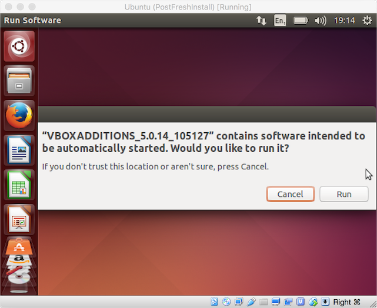

5. Enter your _password_ and select __Authenticate__ to run the installation script as _root_.

  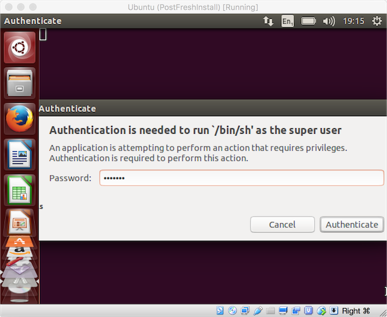

6. You should see the following output indicating you've succeeded.

  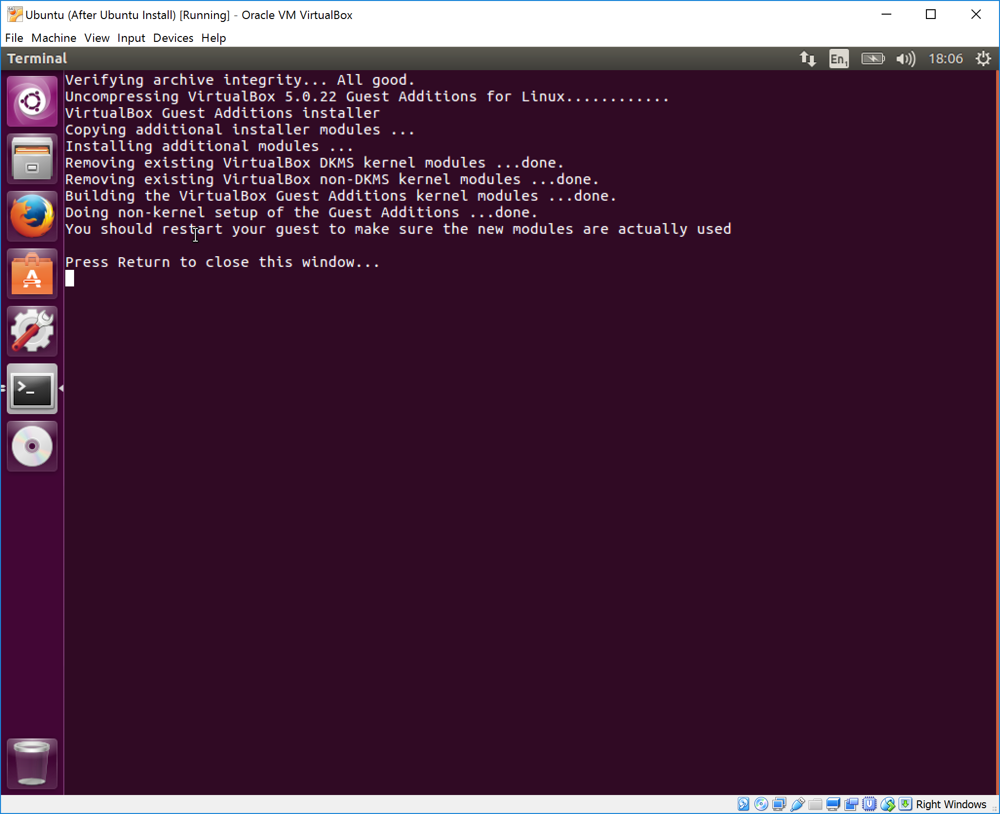

7. Press `ENTER` to close the terminal.

8. Open a new terminal and run `sudo reboot` to restart your VM.

To confirm that everything's working OK do the following:

1. Open _System Settings_ by pressing the `SUPER` (Windows) key, typing `system se` and then hitting `ENTER`.

2. Open the _Screen Display_ option and then select whichever resolution takes your fancy. I selected `1024x768` which in "retina mode + 200% scale factor" will be `2048x1536` size-wise.

3. Run `glxgears`. If the "world falls over" then shut down your VM `sudo shutdown -h now` and reconfigure your VM to deselect __enable 3D acceleration__. Start your VM again and re-run `glxgears` to make sure all is now well.


__Note:__ See [VirtualBox ticket 12941](https://www.virtualbox.org/ticket/12941) for more information.

## Updating your new system

If GUI application [Software Updater](https://wiki.ubuntu.com/SoftwareUpdates) is open (it opens automatically on startup if there are updates) then close it. We're going to use the terminal-based update system (described above) to update our system now.

1. Open a new Terminal and run `apt-get update` to update to the latest package definition list. You should see the following error message:

  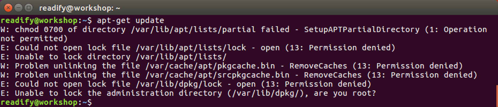

2. So we _need root_ eh? Indeed. Root is the _super user_ (administrator) on Unix variants. Let's try our command again but this time we'll preface it with the `sudo` (super-user do) command to run it "as root". Run the command `sudo apt-get update` and let's see what happens:

  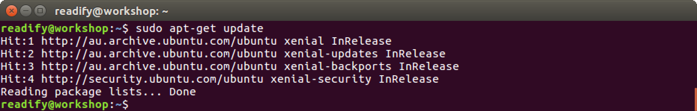

3. You will see that you are prompted for _your_ password (not the root password) to confirm that you are in the list of _sudoers_ i.e. the list of users who have been granted the ability to run commands "as root" by the super user. The first account created as part of the installation gets sudoers access automatically.

4. Now that we have an up-to-date package definition list we can run `sudo apt-get upgrade` to upgrade our system to the latest package and security updates:

  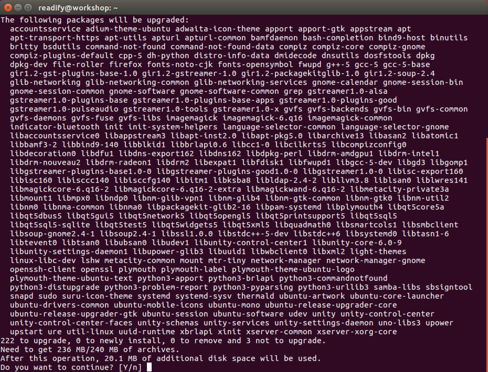

5. Once `sudo apt-get upgrade` has completed running you should see that it has "done" its job successfully:

  

## Adding some useful programs

OK so what's next? Let's install some general programs we'll need later.

#### Git

We'll need `git` for sure, so let's `sudo apt-get install git` now.

#### Vim

We'll need a text editor and I'm a `vim` _mouse potato_ so let's `sudo apt-get install vim` now.

#### Emacs

If you prefer `emacs` you could `sudo apt-get install emacs` and then add the awesome [spacemacs](https://github.com/syl20bnr/spacemacs) distribution like so `git clone https://github.com/syl20bnr/spacemacs ~/.emacs.d && emacs --insecure`.

#### Sublime Text 3

So we have even more text-editing options let's install _Sublime Text 3_. There are two options for doing this which I will use to illustrate some other ways of getting software installed over and above _just downloading a binary_.

1. Our first option is to download a `.dpkg` from the [Sublime Text 3](https://www.sublimetext.com/3) homepage and then install it using the `dpkg -i` command i.e. run the `wget https://download.sublimetext.com/sublime-text_build-3114_amd64.deb && sudo dpkg -i sublime-text_build-3114_amd64.deb` command.

2. Our second (and the better) option is to use the _Sublime Text 3 Installer PPA_. A [PPA](https://en.wikipedia.org/wiki/Personal_Package_Archive) is a _Personal Package Archive_ which is simply just an unofficial APT repository hosted by an individual on Canonical's [Launchpad](https://launchpad.net/) software collaboration service. Run the following commands to install Sublime Text 3 using the PPA.

  > [Canonical](http://www.canonical.com/) is the company behind the Ubuntu Linux distribution.

  ```
  sudo add-apt-repository ppa:webupd8team/sublime-text-3
  ```

  

  ```
  sudo apt-get update
  ```

  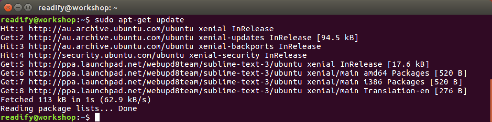

  ```
  sudo apt-get install sublime-text-installer
  ```

  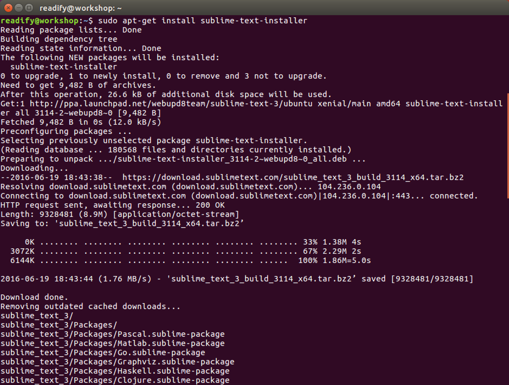

Now run `subl` to confirm that Sublime Text 3 is available and working OK.

#### Atom

If you're like me you want GitHub's [Atom](https://atom.io/)! If so run `wget https://github.com/atom/atom/releases/download/v1.8.0/atom-amd64.deb && sudo dpkg -i atom-amd64.deb` now.

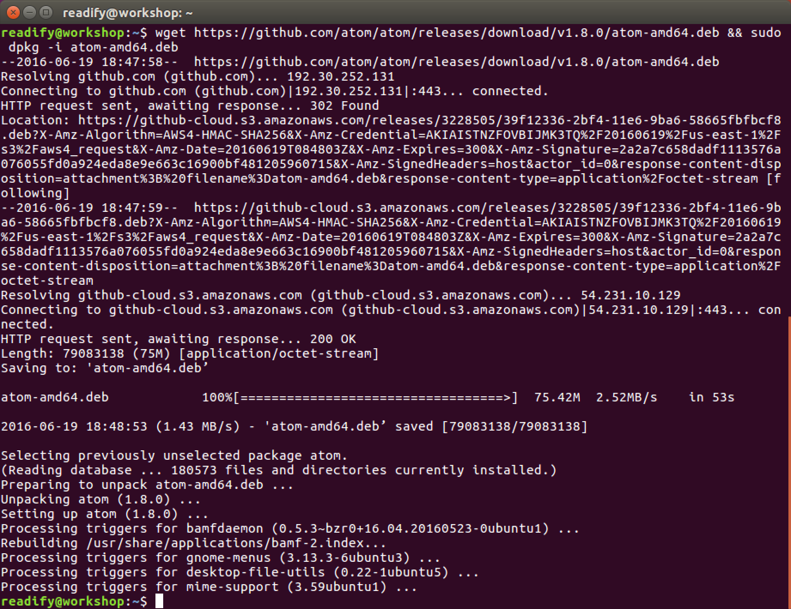

Now run `atom` to confirm that Atom is available and working OK.

#### Brackets _(optional)_

You might use Adobe [Brackets](http://brackets.io/)? If so here's what you do:

```
sudo add-apt-repository ppa:webupd8team/brackets
```

```
sudo apt-get update
```

```
sudo apt-get install brackets
```

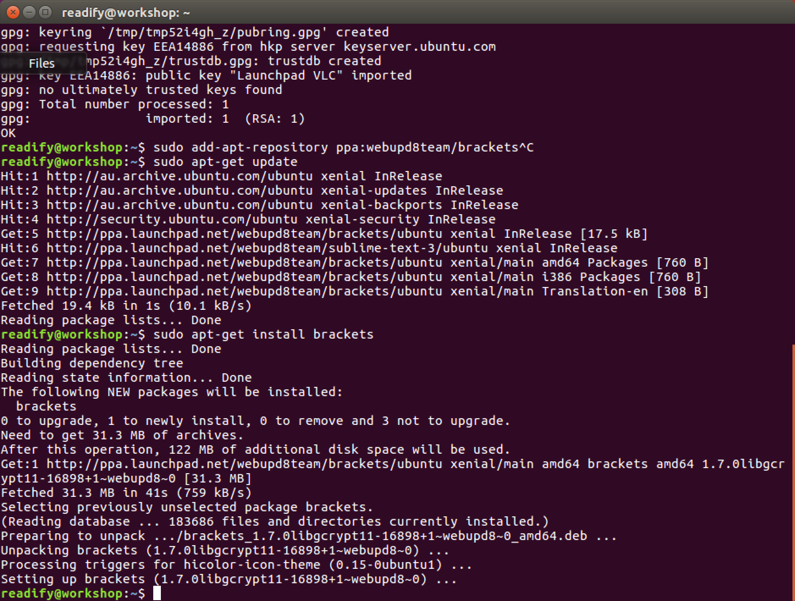

Now run `brackets` to confirm that Adobe Brackets is available and working OK.

__Note:__ Brackets wouldn't load correctly for me so your mileage may vary...

#### Visual Studio Code _(the dpkg method)_

You must have thought I was forgetting something by now! Here's what you do:

```
wget https://go.microsoft.com/fwlink/?LinkID=760868 -O vscode-amd64.deb
```

```
sudo dpkg -i vscode-amd64.deb
```

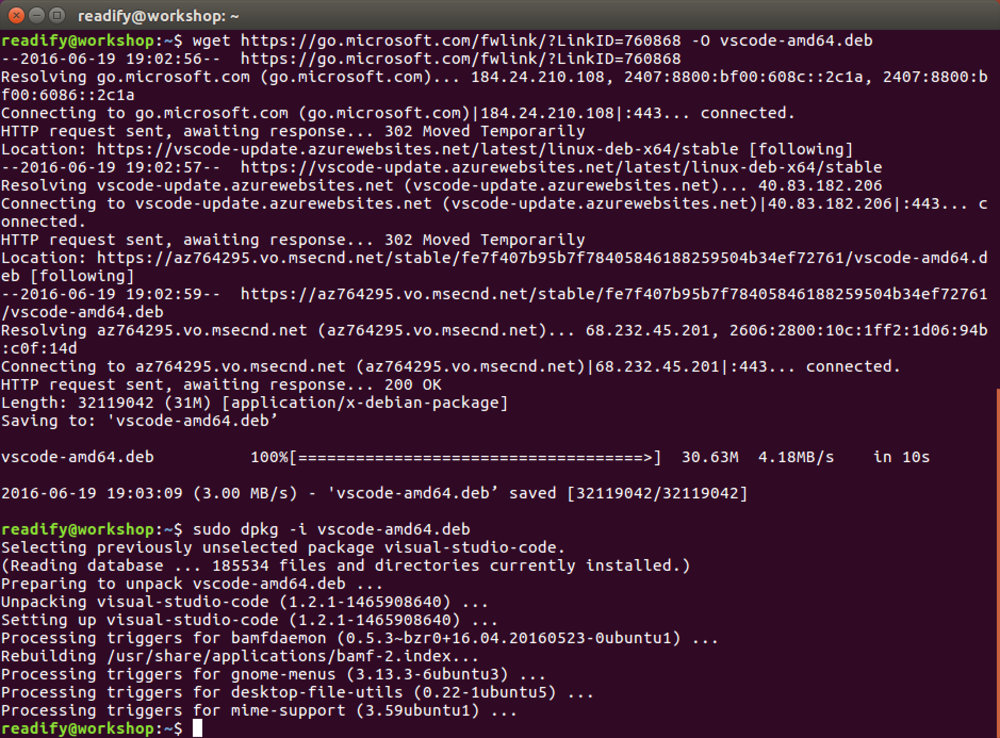

Now run `code` to confirm that Visual Studio Code is available and working OK...

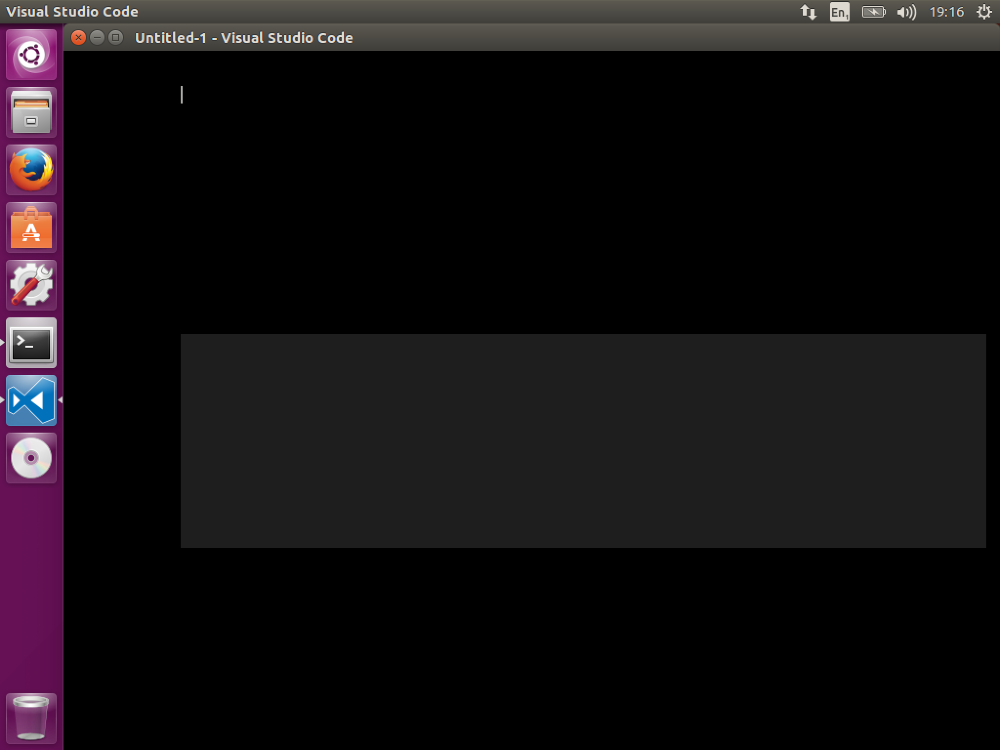

You'll see that it's _not_ working, so let's fix that now.

#### Fixing Visual Studio Code

Let's take stock of what we know:

1.  The issue we're seeing here looks to be a GPU rendering issue.

2. We know that Visual Studio Code is an [Electron](http://electron.atom.io) application, so "under the hood" it has [Node](https://nodejs.org), [Chromium](https://www.chromium.org) and [V8](https://developers.google.com/v8/).

3. We know that Chromium (Chrome) has hardware accelerated rendering.

__Hypothesis =>__ Our issue is caused by a combination of the "VirtualBox virtual GPU" and "Chromium's hardware accelerated rendering".

__Solution?__ Disable the hardware accelerated rendering (for now).

Fortunately someone else has the [workaround](http://stackoverflow.com/a/30007549/372666) for us. Run Visual Studio Code again as follows:

```
code --disable-gpu
```


#### Visual Studio Code _(the umake method)_

A better idea is to install Visual Studio Code with `umake` which will help us automatically keep it up to date.

> [_Ubuntu Make_](https://wiki.ubuntu.com/ubuntu-make) `umake` is a command line tool which allows you to download the latest version of popular developer tools on your installation, installing it alongside all of the required dependencies (which will only ask for root access if you don't have all the required dependencies installed already), enable multi-arch on your system if you are on a 64 bit machine, integrate it with the Unity launcher. Basically, one command to get your system ready to develop with!

Firstly let's _remove_ the version of Visual Studio Code previously installed.

1. Hit the __SUPER__ _(Windows/Command)_ key and type `remove`.

2. Click on `Ubuntu Software`.

3. Select `Installed` and scroll down to `Visual Studio Code`.

4. Click on `Remove` and then confirm `Remove` to remove Visual Studio Code.

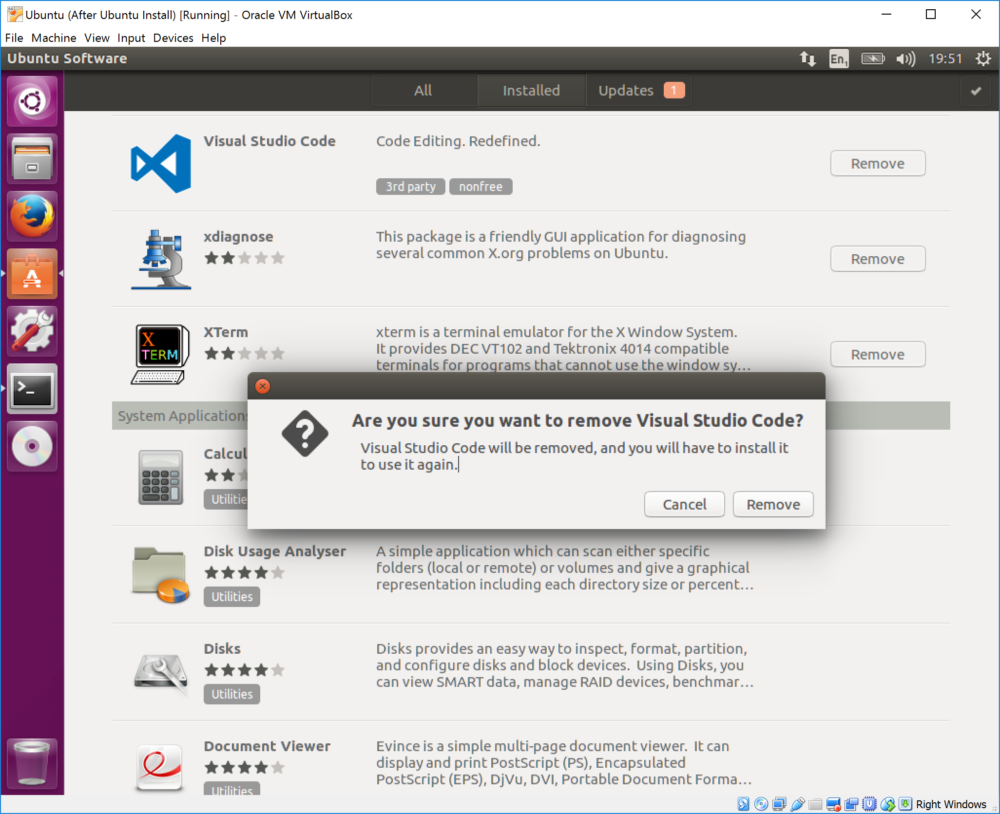

Then run the following (sourced from [Ask Ubuntu](http://askubuntu.com/a/616363/42342)) to install Visual Studio Code again:

```
sudo add-apt-repository ppa:ubuntu-desktop/ubuntu-make
```

```
sudo apt-get update
```

```
sudo apt-get install ubuntu-make
```

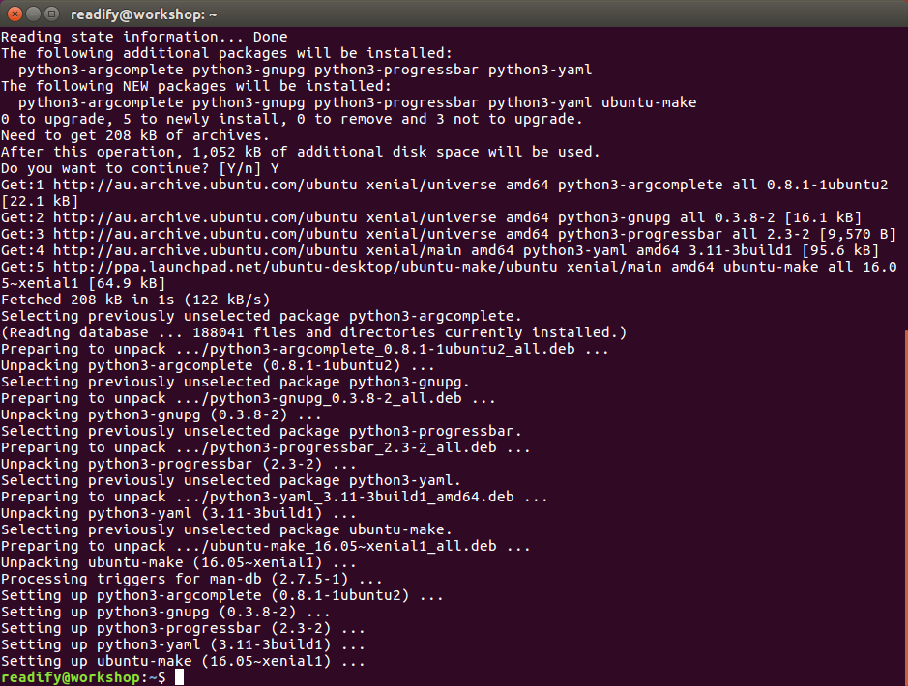

```
umake ide visual-studio-code
```

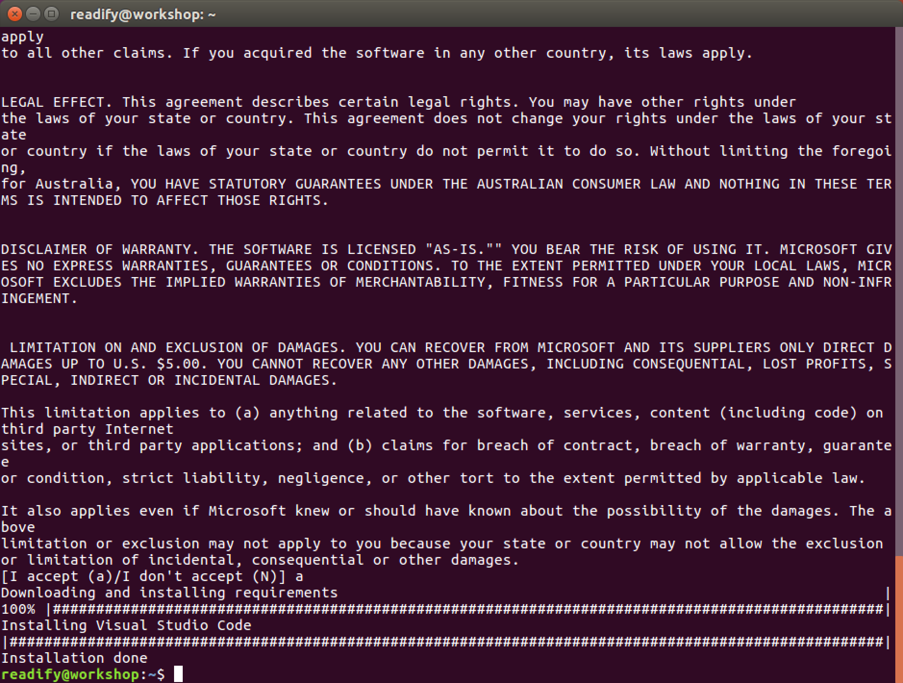

If you were paying attention you would have noticed a reference to the new location of Visual Studio Code, so let's go there now:

```
cd /home/readify/.local/share/umake/ide/visual-studio-code
```

Now run `code --disable-gpu` again to confirm that Visual Studio Code is still available and working correctly.

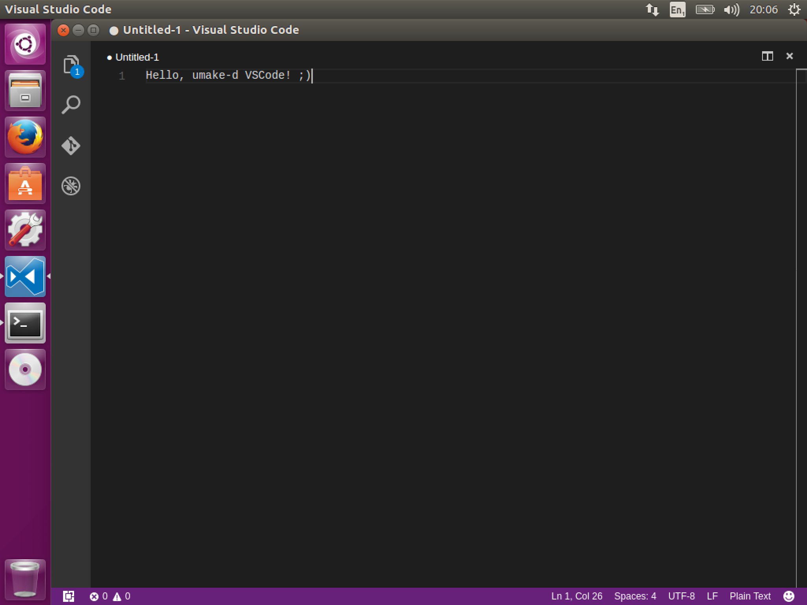

## _All right stop, collaborate and listen!_

Add `/home/readify/.local/share/umake/ide/visual-studio-code` to your `$PATH` and reboot to confirm that it's permanent (survives a reboot).

You'll know you have it working when you can run `code --disable-gpu` from any location...

## End of Part 2

__Good job!__ You are now in possession of a configured and maintainable Linux VM.

Take a 5 minute coffee break and then head over to [3. "Hello, world!" .NET Core ](Part3.md).
