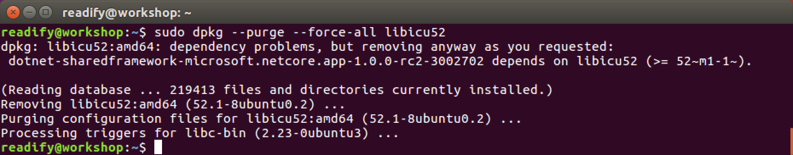
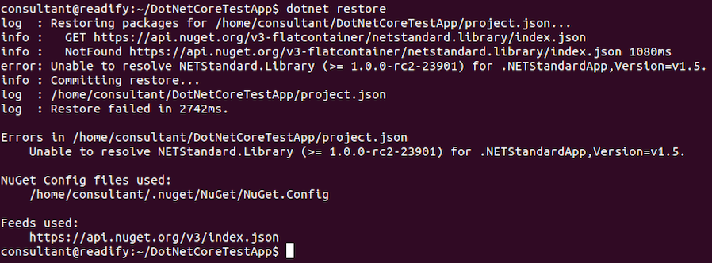

# 3. "Hello, world!" .NET Core


## .NET Core on Ubuntu Linux

__Note:__ In order to avoid excessive rehashing of work that's currently in a state of flux I will be providing _fast_ instructions on how to install .NET Core on Ubuntu Linux.

For more information see [here](https://www.microsoft.com/net/core#ubuntu). The following is practically verbatim from that source, except that we're installing it on Ubuntu 16.04 LTS (the latest) not 14.04.4 LTS (from two years ago).

#### Add the .NET Core APT feed

First let's add the .Net Core APT feed.

```
sudo sh -c 'echo "deb [arch=amd64] https://apt-mo.trafficmanager.net/repos/dotnet/ trusty main" > /etc/apt/sources.list.d/dotnetdev.list'
```

```
sudo apt-key adv --keyserver apt-mo.trafficmanager.net --recv-keys 417A0893
```

```
sudo apt-get update
```


#### Install .NET Core (Take 1)

Next let's install .Net Core.

```
sudo apt-get install dotnet-dev-1.0.0-preview1-002702
```


Whoops! That didn't work too well. We've encountered an issue due to installing on Ubuntu 16.04 not 14.04.4 (the RC2 supported platform). Let's fix that now.

#### Fixing .NET Core on Ubuntu 16.04

From a 1 minute Google search we can [find the solution](http://donovanbrown.com/post/2016/05/29/Installing-NET-Core-RC2-on-Ubuntu-1604).

```
wget http://security.ubuntu.com/ubuntu/pool/main/i/icu/libicu52_52.1-8ubuntu0.2_amd64.deb
```

```
sudo dpkg -i libicu52_52.1-8ubuntu0.2_amd64.deb
```


#### Install .NET Core (Take 2)

OK let's try installing .Net Core again.

```
sudo apt-get install dotnet-dev-1.0.0-preview1-002702
```


Success! Let's see what's next...

#### Check for a newer version of .NET Core

Let's see if there's a newer version of .NET Core available.

```
sudo apt-get update && sudo apt-get upgrade
```


There isn't, which is good news. We are completely up to date.

#### Testing .NET Core version

Let's check the version of `dotnet` that we've have.

```
dotnet --version
```


Oh no! The "classic" Unix [segfault](https://en.wikipedia.org/wiki/Segmentation_fault). Let's see what we can do about fixing this up...

#### Fixing .NET Core on Ubuntu 16.04 (again)

Firstly let's take a look at the version of `libicu52` we installed earlier.

```
ls ~
```


We can see that we're currently using `libicu52_52.1-8ubuntu0.2_amd64.deb`.

It turns out this is not the version of `libicu52_52.1` we want.

The [version we actually want](http://zablo.net/blog/post/run-and-debug-asp-net-core-rc2-ubuntu-16-04) is  `libicu52_52.1-3ubuntu0.4_amd64.deb`.


Yep we're trying to run .NET Core on an as-yet-unsupported platform.

But let's see if we can fix that up now.

1. Firstly let's remove the version install in error.

  ```
  sudo dpkg --purge --force-all libicu52
  ```

  

2. Then let's delete the old `.deb` package file so we don't get confused.

  ```
  rm ~/libicu52_52.1-8ubuntu0.2_amd64.deb
  ```

  

3. Next we'll download the correct `libicu52` package version.

  ```
  wget http://security.ubuntu.com/ubuntu/pool/main/i/icu/libicu52_52.1-3ubuntu0.4_amd64.deb
  ```

  

4. Finally we'll install the new version of `libicu52`.

  ```
  sudo dpkg -i libicu52_52.1-3ubuntu0.4_amd64.deb
  ```

  

#### Testing .NET Core version (again)

Let's again check the version of `dotnet` that we've have.

```
dotnet --version
```


Awesome! We now have version `1.0.0-beta-001673` of .NET Core.

#### Initialise some code

```
mkdir DotNetCoreTestApp
```

```
cd DotNetCoreTestApp
```

```
dotnet new
```


#### Run package restore

```
dotnet restore
```



#### Oh no!

So it turns out that `api.nuget.org` does not yet contain the .NET Core packages. You can find out more about this issue [here](https://github.com/dotnet/cli/issues/535). Let's try `dotnet restore` again, but this time we'll supply the package source as an extra parameter.

```
dotnet restore -s https://myget.org/f/dotnet-core
```


#### Run the application

```
dotnet run
```


## End of Part 3

__Excellent!__ You have said hello to the world of _.NET Core_.

Have a quick break and then continue with [4. "Hello, world!" ASP.NET Core](Part4.md).
