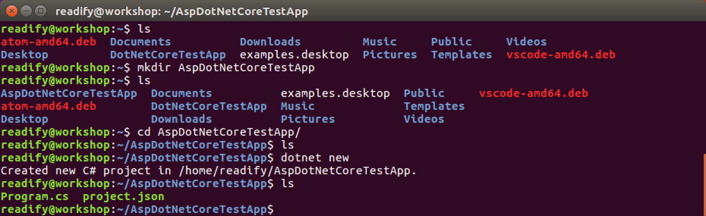
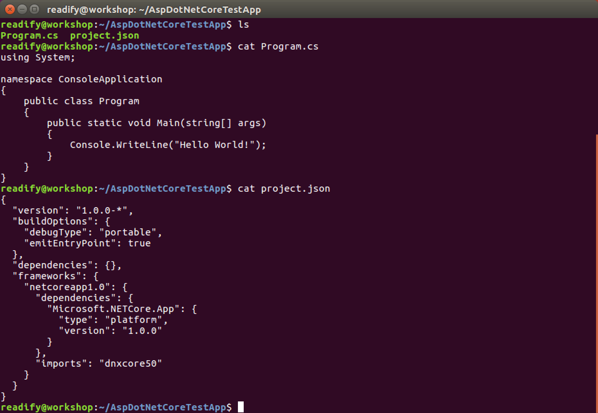
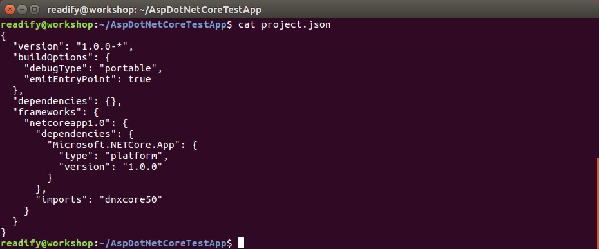
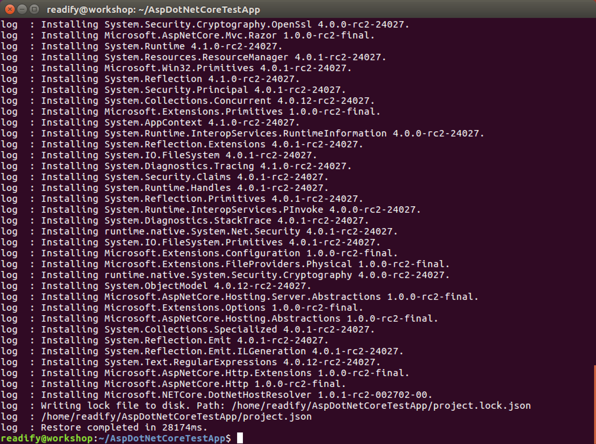
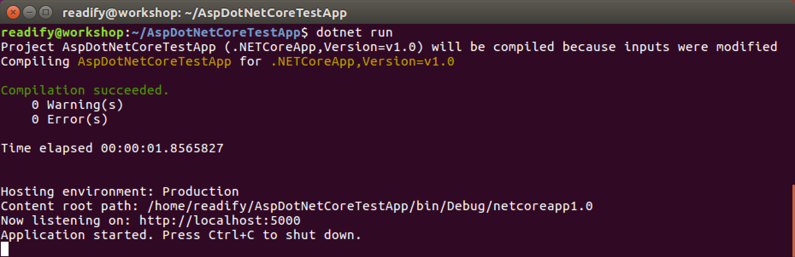
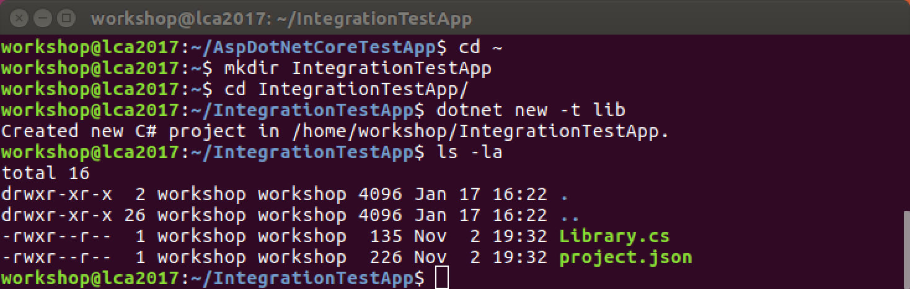
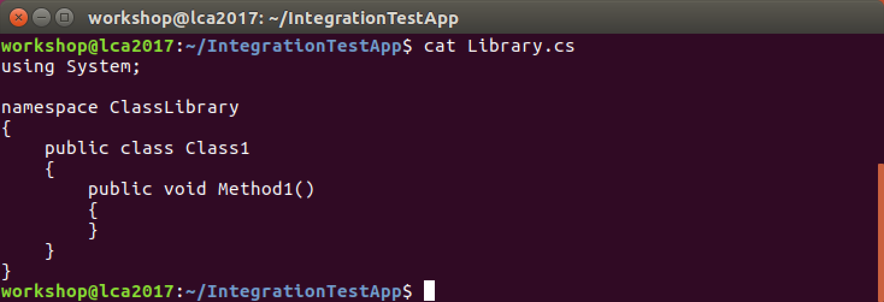
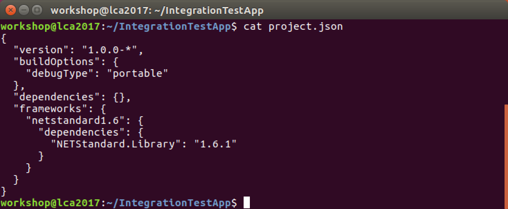
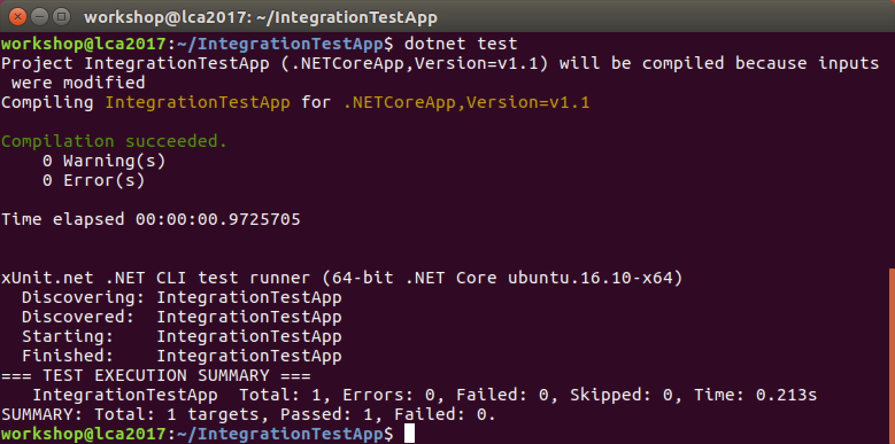
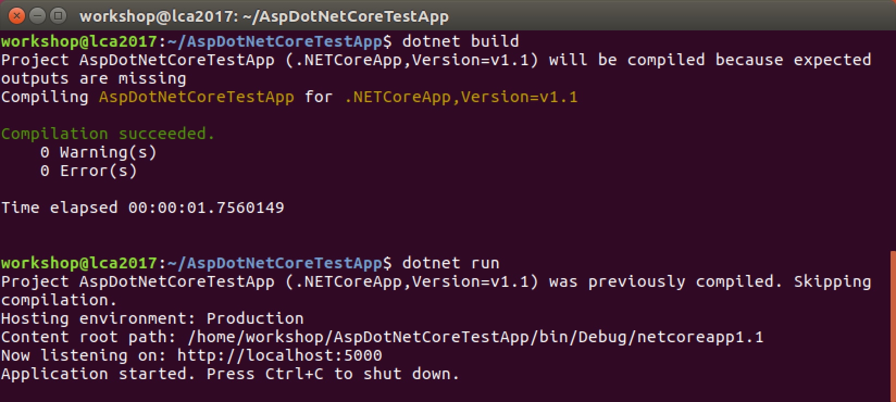

# 4. "Hello, world!" ASP.NET Core


## ASP.NET Core

All you need to do install ASP.NET Core is to run the following command.

```
dotnet
```


So I lied... Clearly you _already_ had it installed... ;)

#### Creating an ASP.NET Core Project

OK. Let's create a new ASP.NET Core Project. We begin the process exactly as we did for .NET Core; by using the `new` project scaffolding command.

```
mkdir AspDotNetCoreTestApp
```

```
cd AspDotNetCoreTestApp
```

```
dotnet new
```



Let's take a closer look this time at what the `dotnet new` command creates for us.

```
ls
```

```
cat Program.cs
```

```
cat project.json
```



## Our first ASP.NET Core Web API

As we've seen before a "vanilla" .NET Core / ASP.NET Core application is just a "main method" and a "project file".

> _But hang on... like... where's the web man?_

#### `Program.cs`

Fine. Let's add some "web stuff" to our .NET Core application to make it into an ASP.NET Core application. Open `Program.cs` with your text editor of choice and update it as follows.

```csharp
using Microsoft.AspNetCore.Hosting;

namespace HelloUniverse
{
    public class HelloWorld
    {
        public static void Main(string[] args)
        {
            var host = new WebHostBuilder()
                .UseKestrel()
                .UseStartup<Startup>()
                .Build();

            host.Run();
        }
    }
}
```

You can see that the job of the "main method" in an ASP.NET Core application is to:

1. Create the new `WebHostBuilder()` used to fluently configure the web host before execution.

2. `UseKestrel()` to instruct that the web server to be used in development is [Kestrel](https://github.com/aspnet/KestrelHttpServer).

3. To configure the web host to `.UseStartup<Startup>()` where `Startup` is the name of the class containing our bootstrapping code (more on this in a second).

4. To `Build()` the web host configuration.

5. And lastly to `Run()` the web host i.e. Run `Startup` inside of Kestrel.

_Kestrel is built on top of [`libuv`](https://github.com/libuv/libuv) the HTTP server made famous by the [Node.js](https://nodejs.org/en/) project._

#### `Startup.cs`

I'm sure you've realised we now need a class `Startup`. Create `Startup.cs` with your text editor of choice and update it as follows.

```csharp
using Microsoft.AspNetCore.Builder;
using Microsoft.Extensions.DependencyInjection;

namespace HelloUniverse
{
    public class Startup
    {
        public void ConfigureServices(IServiceCollection services)
        {
            services.AddMvc();
        }

        public void Configure(IApplicationBuilder app)
        {
            app.UseMvc();
        }
    }
}
```

You can see that the job of the "startup class" in an ASP.NET Core application is to:

1. `ConfigureServices` used by your app (e.g. ASP.NET MVC Core, ASP.NET Web API Core, Entity Framework Core, Identity). In our case we're just using `AddMvc()` to add ASP.NET MVC (Web API) Core.

2. `Configure` the _middleware_ in the request pipeline. At this point we're simply going to `UseMvc()` to use ASP.NET MVC (Web API) Core.

_If you're interested take a deeper look at [application startup](https://docs.asp.net/en/latest/fundamentals/startup.html)._

#### `HelloWorldController.cs`

Lastly we need to implement our Web API endpoint. Create `HelloWorldController.cs` with your text editor of choice and update it as follows.

```csharp
using Microsoft.AspNetCore.Mvc;

namespace HelloUniverse
{
    [Route("api/[controller]")]
    public class HelloWorldController : Controller
    {
        // GET api/HelloWorld
        [HttpGet]
        public string Get()
        {
            return "Hello, world!";
        }
    }
}
```

#### `project.json`

Let's take another look at our `Project.json`.

```
cat project.json
```



With your text editor of choice update `project.json` as follows.

```json
{
  "version": "1.0.0-*",
  "buildOptions": {
    "debugType": "portable",
    "emitEntryPoint": true
  },
  "dependencies": {
    "Microsoft.AspNetCore.Mvc": "1.1.0",
    "Microsoft.AspNetCore.Server.Kestrel": "1.1.0"
  },
  "frameworks": {
    "netcoreapp1.1": {
      "dependencies": {
        "Microsoft.NETCore.App": {
          "type": "platform",
          "version": "1.1.0"
        }
      },
      "imports": "dnxcore50"
    }
  }
}
```

That's all we should need for our first Web API.

## Running our ASP.NET Core Web API

First let's restore our NuGet packages.

```
dotnet restore
```




Now let's run our application.

```
dotnet run
```



## Testing our ASP.NET Core Web API

Open Firefox and navigate to `http://localhost:5000/api/HelloWorld`.


## Integration Testing in ASP.NET Core

Next we're going to look at a very simple example of an integration test in .NET Core which will call our newly create Web API and test its functionality.

#### Creating a new integration test project

Let's create a new integraton test project.

```
cd ~
mkdir IntegrationTestApp
cd IntegrationTestApp
dotnet new -t lib
ls -la
```

You should see the following output.



You might have noticed that we're using an ammended version of the `dotnet new` command. `dotnet new -t lib` creates a new .NET Core project which is a "class library". This means that it has no requirement for a `public static void Main(string[] args)`.

You can also see that instead of `Program.cs` we have `Library.cs` which is the scaffolded skeleton of a class library. Let's take a look at `Library.cs`.

```
cat Library.cs
```



Let's also take a look at `project.json`.

```
cat project.json
```



#### `project.json`

We'll update our new .NET Core application adding [xUnit.net](http://xunit.github.io) and [`xunit.runner.console`](https://www.nuget.org/packages/xunit.runner.console/) as we did for our unit test previously.

```json
{
  "version": "1.0.0-*",
  "testRunner": "xunit",
  "buildOptions": {
    "debugType": "portable"
  },
  "dependencies": {
    "xunit":"2.2.0-beta4-build3444",
    "dotnet-test-xunit": "2.2.0-preview2-build1029"
  },
  "frameworks": {
    "netcoreapp1.1": {
      "dependencies": {
        "Microsoft.NETCore.App": {
          "type": "platform",
          "version": "1.1.0"
        }
      },
      "imports": "dnxcore50"
    }
  }
}
```

Run `dotnet restore` now to restore (download) the two new dependencies.

__TODO:__ Explain the differences between `netstandard1.6` and `netcoreapp1.1`.

#### `Library.cs`

Let's update our `Program.cs` to turn it into an Integration Test.

```csharp
using System.Net.Http;
using Xunit;

namespace IntegrationTestClassLibrary
{
    public class IntegrationTestClass
    {
        [Fact]
        public async void IntegrationTestMethod()
        {
            using (var client = new HttpClient())
            {
                client.DefaultRequestHeaders.Add("Accept", "text/plain");
                var uri = "http://localhost:5000/api/HelloWorld";
                var response = await client.GetAsync(uri);

                // Throws an exception if the IsSuccessStatusCode
                // property for the HTTP response is false.                    
                response.EnsureSuccessStatusCode();

                var data = await response.Content.ReadAsStringAsync();
                Assert.Equal("Hello, world!", data);
            }
        }
    }
}
```

#### `dotnet build`

Next run `dotnet build` to build your integration test library.


#### `dotnet test`

Next run `dotnet test` to run your integration test.



You should now see that your integration test has passed!

If you're integration test doesn't pass, make sure you're still running the other web project that your integration test is testing.



Excellent. You have now written your first .NET Core integration test.

## _All right stop, collaborate and listen!_

Feel free to build out your ASP.NET Core Web API server with some more [HTTP methods](https://www.w3.org/Protocols/rfc2616/rfc2616-sec9.html) and then update your .NET Core application (from the previous chapter) to call your Web API `using System.Net.Http` (as a client).

## End of Part 4

__Winning!__ You have a basic _Web API_ written in _ASP.NET Core_.

Take a coffee break (if you need it) and then continue with [5. "Hello, world!" Docker](Part5.md).
