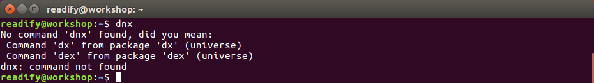
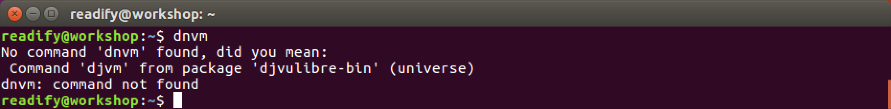
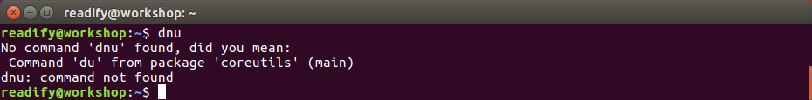
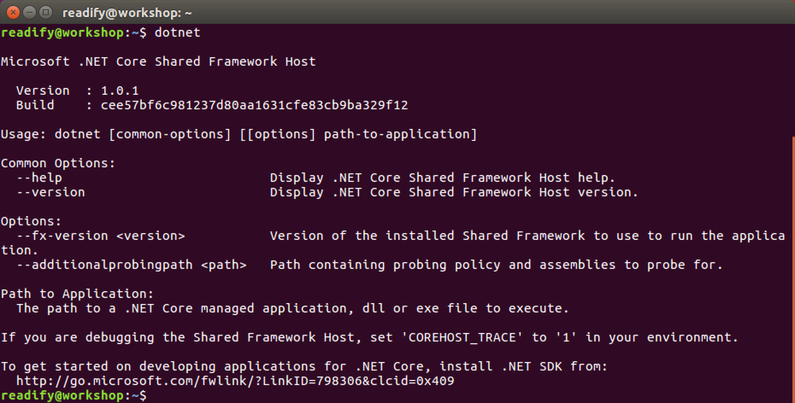
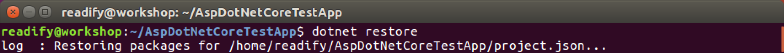
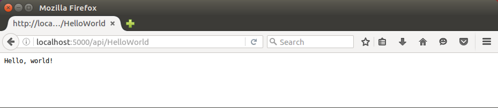

# 4. "Hello, world!" ASP.NET Core


## ASP.NET Core on Ubuntu Linux (RC1)

The world of ASP.NET Core has changed significantly from RC1 to RC2.

1. `DNX` the _.NET Execution Runtime_ is no more.

  

2. `DNVM` the _.NET Version Manager_ (the install script for obtaining `DNX`) is gone.

  

3. `DNU` the _.NET Developer Utility_ (for managing dependencies, building and publishing your applications) is out the window.

  

But that's nothing to worry about. For anyone with an RC1 application there _is_ a [migration path](https://dotnet.github.io/docs/core-concepts/dnx-migration.html) and the functions previously provided by `dnx`, `dnvm` and `dnu` are now provided by the `dotnet` CLI.

__Awesome!__ Interacting with ASP.NET Core is now very simple indeed.

## ASP.NET Core on Ubuntu Linux (RC2 and 1.0+)

All you need to do install ASP.NET Core is to run the following command.

```
dotnet
```



So I lied... Clearly you _already_ had it installed... ;)

## Creating an ASP.NET Core Project

OK. Let's create a new ASP.NET Core Project. We begin the process exactly as we did for .NET Core; by using the `new` project scaffolding command.

```
mkdir AspDotNetCoreTestApp
```

```
cd AspDotNetCoreTestApp
```

```
dotnet new
```


Let's take a closer look this time at what the `dotnet new` command creates for us.

```
ls
```

```
cat Program.cs
```

```
cat project.json
```


## Our first ASP.NET Core Web API

As we've seen before a "vanilla" .NET Core / ASP.NET Core application is just a "main method" and a "project file".

> _But hang on... like... where's the web man?_

#### Program.cs

Fine. Let's add some "web stuff" to our .NET Core application to make it into an ASP.NET Core application. Open `Program.cs` with your text editor of choice and update it as follows.

```C#
using Microsoft.AspNetCore.Hosting;

namespace HelloUniverse
{
    public class HelloWorld
    {
        public static void Main(string[] args)
        {
            var host = new WebHostBuilder()
                .UseKestrel()
                .UseStartup<Startup>()
                .Build();

            host.Run();
        }
    }
}
```

You can see that the job of the "main method" in an ASP.NET Core application is to:

1. Create the new `WebHostBuilder()` used to fluently configure the web host before execution.

2. `UseKestrel()` to instruct that the web server to be used in development is [Kestrel](https://github.com/aspnet/KestrelHttpServer).

3. To configure the web host to `.UseStartup<Startup>()` where `Startup` is the name of the class containing our bootstrapping code (more on this in a second).

4. To `Build()` the web host configuration.

5. And lastly to `Run()` the web host i.e. Run `Startup` inside of Kestrel.

_Kestrel is built on top of [`libuv`](https://github.com/libuv/libuv) the HTTP server made famous by the [Node.js](https://nodejs.org/en/) project._

#### Startup.cs

I'm sure you've realised we now need a class `Startup`. Create `Startup.cs` with your text editor of choice and update it as follows.

```C#
using Microsoft.AspNetCore.Builder;
using Microsoft.Extensions.DependencyInjection;

namespace HelloUniverse
{
    public class Startup
    {
        public void ConfigureServices(IServiceCollection services)
        {
            services.AddMvc();
        }

        public void Configure(IApplicationBuilder app)
        {
            app.UseMvc();
        }
    }
}
```

You can see that the job of the "startup class" in an ASP.NET Core application is to:

1. `ConfigureServices` used by your app (e.g. ASP.NET MVC Core, ASP.NET Web API Core, Entity Framework Core, Identity). In our case we're just using `AddMvc()` to add ASP.NET MVC (Web API) Core.

2. `Configure` the _middleware_ in the request pipeline. At this point we're simply going to `UseMvc()` to use ASP.NET MVC (Web API) Core.

_If you're interested take a deeper look at [application startup](https://docs.asp.net/en/latest/fundamentals/startup.html)._

#### HelloWorldController.cs

Lastly we need to implement our Web API endpoint. Create `HelloWorldController.cs` with your text editor of choice and update it as follows.

```
using Microsoft.AspNetCore.Mvc;

namespace HelloUniverse
{
    [Route("api/[controller]")]
    public class HelloWorldController : Controller
    {
        // GET api/HelloWorld
        [HttpGet]
        public string Get()
        {
            return "Hello, world!";
        }
    }
}
```

#### Project.json

Let's take another look at our `Project.json`.

```
cat project.json
```


With your text editor of choice update `project.json` as follows.

```json
{
  "version": "1.0.0-*",
  "buildOptions": {
    "debugType": "portable",
    "emitEntryPoint": true
  },
  "dependencies": {
    "Microsoft.AspNetCore.Mvc": "1.1.0",
    "Microsoft.AspNetCore.Server.Kestrel": "1.1.0"
  },
  "frameworks": {
    "netcoreapp1.1": {
      "dependencies": {
        "Microsoft.NETCore.App": {
          "type": "platform",
          "version": "1.1.0"
        }
      },
      "imports": "dnxcore50"
    }
  }
}
```

That's all we should need for our first Web API.

## Running our ASP.NET Core Web API

First let's restore our NuGet packages.

```
dotnet restore
```




Now let's run our application.

```
dotnet run
```


## Testing our ASP.NET Core Web API

Open Firefox and navigate to `http://localhost:5000/api/HelloWorld`.



## _All right stop, collaborate and listen!_

Build out your ASP.NET Core Web API server with some more [HTTP methods](https://www.w3.org/Protocols/rfc2616/rfc2616-sec9.html) and then update your .NET Core application (from the previous chapter) to call your Web API `using System.Net.Http` (as a client).

## End of Part 4

__Winning!__ You have a basic _Web API_ written in _ASP.NET Core_.

Take a 5 minute break and then continue with [5. "Hello, world!" Docker](Part5.md).
