# 5. "Hello, world!" Docker


#### What is LXC (Linux Containers)?

> [LXC](https://en.wikipedia.org/wiki/LXC) ([Linux Containers](https://linuxcontainers.org/)) is an operating-system-level virtualization method for running multiple isolated Linux systems (containers) on a control host using a single Linux kernel.

#### What is Docker

> [Docker](https://en.wikipedia.org/wiki/Docker_(software)) is an open-source project that automates the deployment of applications inside software containers, by providing an additional layer of abstraction and automation of operating-system-level virtualization on Linux.

## Installing Docker on Ubuntu Linux

Follow the _Ubuntu Xenial 16.04 (LTS)_ instructions [__here__](https://docs.docker.com/engine/installation/linux/ubuntulinux/) to install Docker Engine.

__Note:__ Make sure to skip the section labelled _Ubuntu Precise 12.04 (LTS)_ as it is not applicable to the version of Ubuntu Linux we are using.

Keep going until you get to `sudo docker run hello-world` and you will see the following.

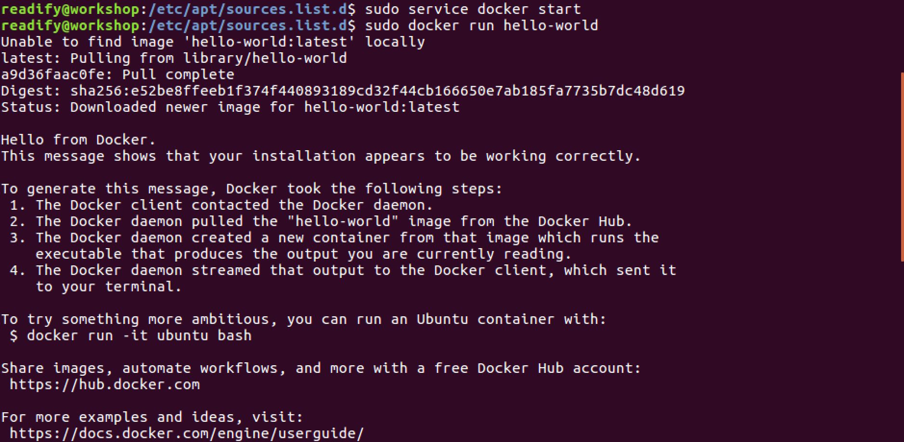

#### Optional Docker Configuration

Now continue on and complete the following  _optional configurations_ as they will make running Docker lower friction and more enjoyable for you.

1. [Create a docker group](https://docs.docker.com/engine/installation/linux/ubuntulinux/#create-a-docker-group) so you don't have to run Docker with `sudo`.

2. [Adjust memory and swap accounting](https://docs.docker.com/engine/installation/linux/ubuntulinux/#adjust-memory-and-swap-accounting) primarily to avoid getting spammed with warnings.

3. [Configure Docker to start on boot](https://docs.docker.com/engine/installation/linux/ubuntulinux/#configure-docker-to-start-on-boot) so you don't have to remember to start it every time.

Once you have completed the three optional Docker configuration steps above, reboot and then run `docker version`. You should see the following output which confirms that Docker Daemon is running.

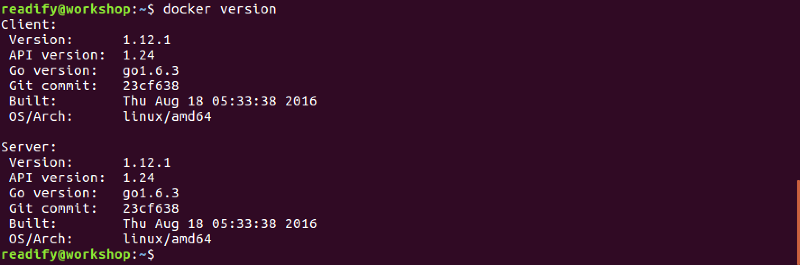

## .NET Core "Hello, world!" on Docker

Lets give .NET core and Docker a go. First we'll get the latest dotnet docker image and run it.

```
docker run -it microsoft/dotnet:latest
```

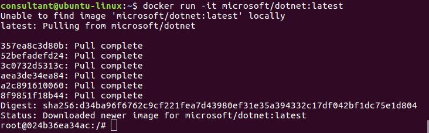

Create a new dotnet core app.

```
mkdir mynewapp
cd mynewapp
dotnet new
```

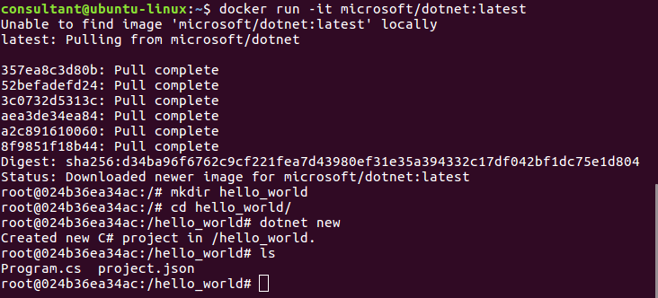

Restore the dependencies and run the app.

```
dotnet restore
dotnet run
```

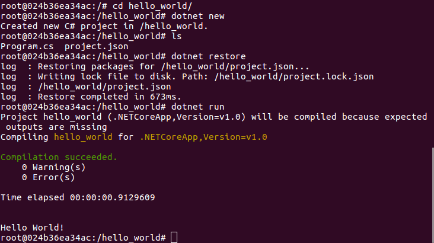

__Superb!__ You now have your "Hello, world!" on both vanilla Docker and .NET Core on Docker.

### Docker 101

Now what just happed there!!! Well first of all, docker pulled down the latest ```microsoft/dotnet``` image from docker hub and ran that in a new Docker container with the ```-it``` switch. Let's go back a bit and explain some of the core components of Docker to better understand what that means.

The 3 main concepts to understand are: Images, Containers and Registries.

#### Images

> Docker images are the recipes for building containers. They are read-only and are usually composed of layers of other images with a base image of something like Ubuntu, Readh at or Debian. The layers are built from ```Dockerfile```'s, which are just a set of instructions of how to build the image.

#### Containers

> Docker containers are running/runnable instances of docker images. Think if images and containers like classes and objects.

#### Registries (i.e. Docker Hub)

> Docker registry's are repositories for docker images. The default public registry is the docker hub. Images are stored on the local host when pulled from the registry.

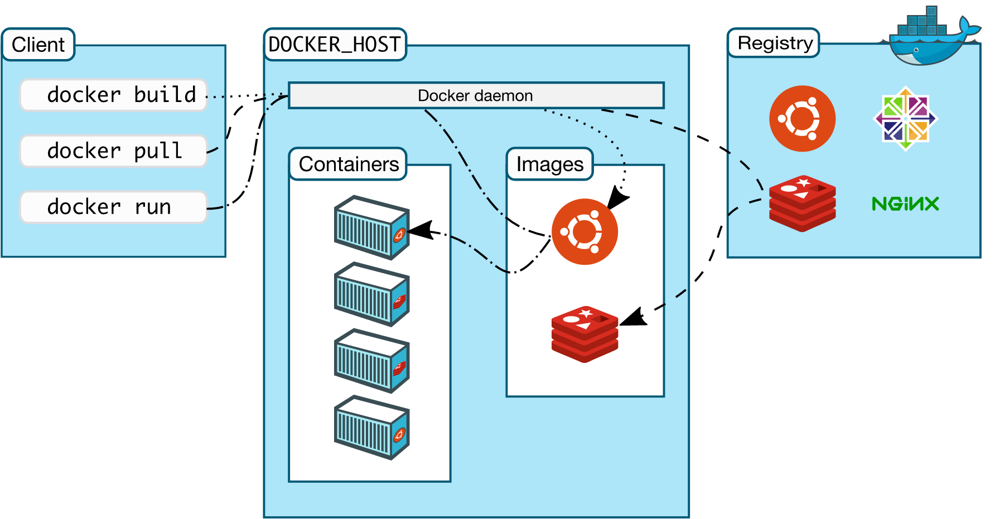

Docker itself is actually a client-server application where the client is the CLI and the server is the docker daemon (a daemon is like a windows service). The CLI is how we send commands to the server. The server then does the heavy lifting of pulling images from the registry and building containers.

Now let's go back to our initial command.

```
docker run -it microsoft/dotnet:latest
```

Because we did not already have the Docker image on our machine, Docker will go to the registry (Docker Hub) and download the image before building the container and running it.

#### Exploring the Docker CLI

We left our terminal inside the actual running Docker container, so let's `exit` that and give a few of the basic docker CLI commands a try.

First of all let's have a look at the images available on the local machine.

```
docker images
```

You should see a list with 2 images like this.

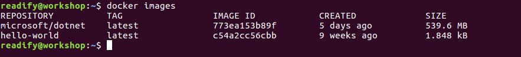

Next, let's have a look at the running containers.

```
docker ps
```

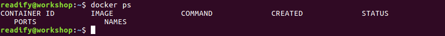

Hmm... No containers running... But we might have some stopped containers.

```
docker ps -a
```

This will give us all containers on the system, running or not.

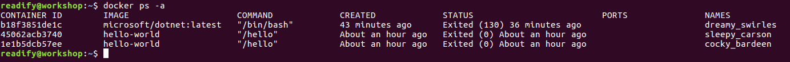

When we started this chapter we started the `microsoft/dotnet` container with the `-it` switch. now let's start it again but this time we'll add `d` to the switches as follows.

```
docker run -itd --name dotnet microsoft/dotnet:latest
```

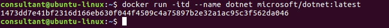

This creates a new container and starts it but does not _attach_ the console to it. Instead it just returns the _id_ of the container.

Run `docker ps` to confirm that we now have a running container.

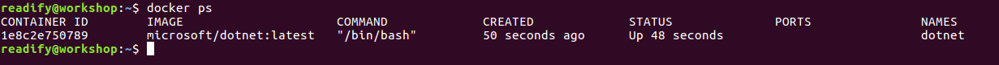

Now to attach to the console of the running container run.

```
docker attach dotnet
```

You may have to press the `ENTER` key in order to see the `ssh` session.

__Pro Tip!__ To escape the container without stopping it, use the escape sequence `Ctrl-p` + `Ctrl-q`.

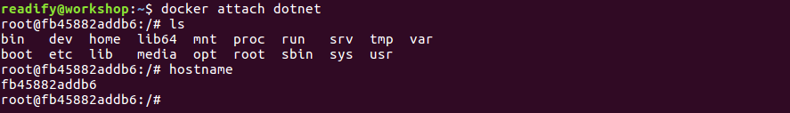

You can now run the following set of commands to clean up your `dotnet` container.

#### Cleaning up the `dotnet` container

Run the following command to `kill` (terminate) the running Docker container `dotnet`.

```
docker kill dotnet
```

Run the following command to `rm` (delete) the `dotnet` Docker container from the filesystem.

```
docker rm dotnet
```


#### Cleaning up _everything_

That's just a basic introduction to running Docker commands. Run the following and have a look around at all the possible commands you could run.

```
docker --help
```

Here are a few examples of some helpful commands for cleaning everything up.

__Stop all containers__

```
docker kill $(docker ps -q)
```

__Remove all containers__

```
docker rm $(docker ps -a -q)
```

__Remove all docker images__

```
docker rmi $(docker images -q)
```

For a more in-depth Docker have a look at the [Docker Docs](https://docs.docker.com/engine/understanding-docker/).

## _All right stop, collaborate and listen!_

So you have seen what Docker can do on Linux. Let's see what Docker can do on macOS and Windows as well.

### Docker for macOS and/or Windows

Recently Docker has also been released for macOS and Windows. Both macOS and Windows run the CLI (client) as a native application, but run the Docker Engine (daemon) through a hypervisor. Hyper-V on Windows and [xhyve](https://github.com/mist64/xhyve/) on macOS.

#### Running "Hello, World!" on macOS on Docker

Have a go at running [Docker on macOS](https://docs.docker.com/docker-for-mac/) using `Docker.dmg`

Keep going until you get your "Hello, World!".

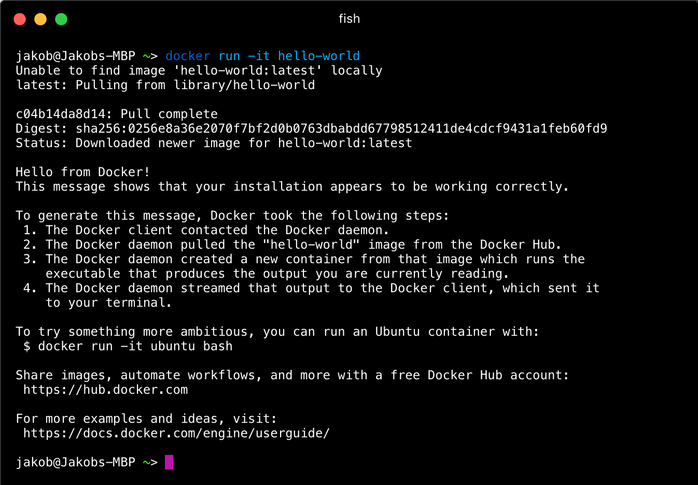

#### Running "Hello, World!" on Windows on Docker

Have a go at running [Docker on Windows](https://docs.docker.com/docker-for-windows/) using `InstallDocker.msi`.

Keep going until you get your "Hello, World!".

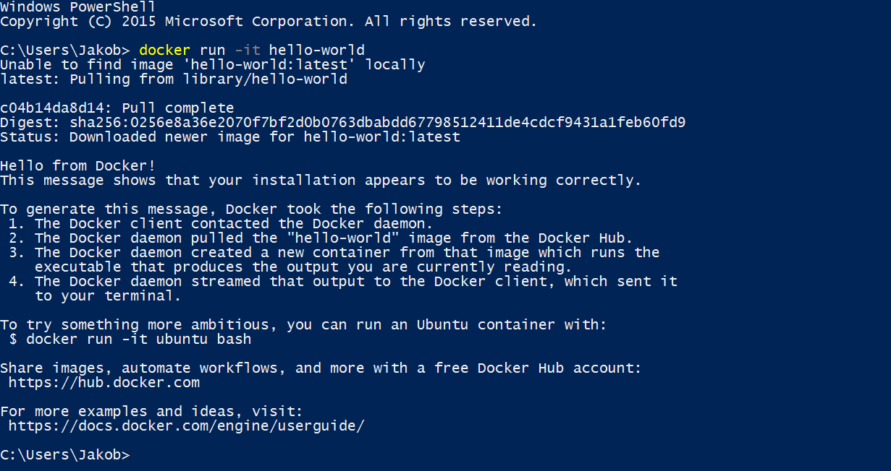

#### Kitematic (beta)

[Kinematic](https://kitematic.com) is a useful GUI application for managing Docker images and containers on macOS and Windows:

> Kitematic is an open source project built to simplify and streamline using Docker on a Mac or Windows (coming soon) PC. Kitematic automates the Docker installation and setup process and provides an intuitive graphical user interface (GUI) for running Docker containers. Kitematic integrates with Docker Machine to provision a VirtualBox VM and install the Docker Engine locally on your machine.

Have a go at installing and using the [Docker Toolbox](https://kitematic.com) via either `DockerToolbox-1.12.3.pkg` on macOS or `DockerToolbox-1.12.3.exe` on Windows.

Have a play around with the product, install some containers and see if you can find something interesting to you. Share what you have found with your neighbours.

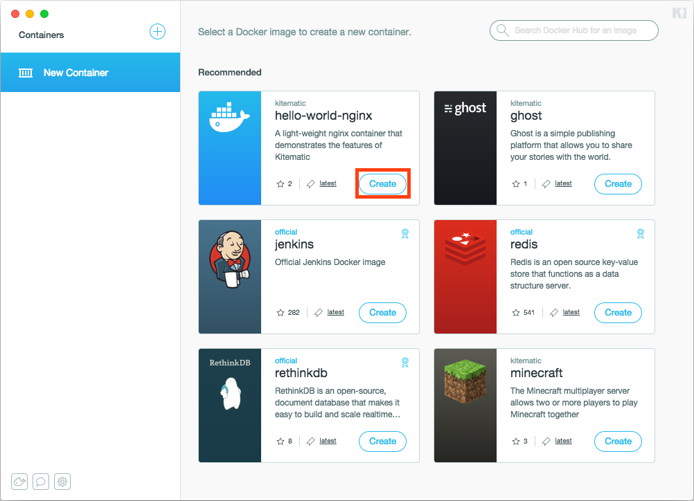

## End of Part 5

__Excellent!__ You have dug into Docker on Linux and you have also seen Docker running on either macOS or Windows.

Take a 5 minute break and then continue with [6. "Hello, world!" via Node.js & Yeoman](Part6.md).
