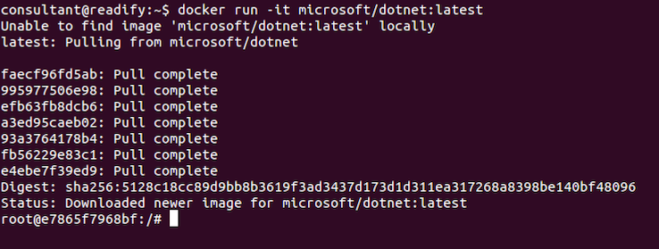
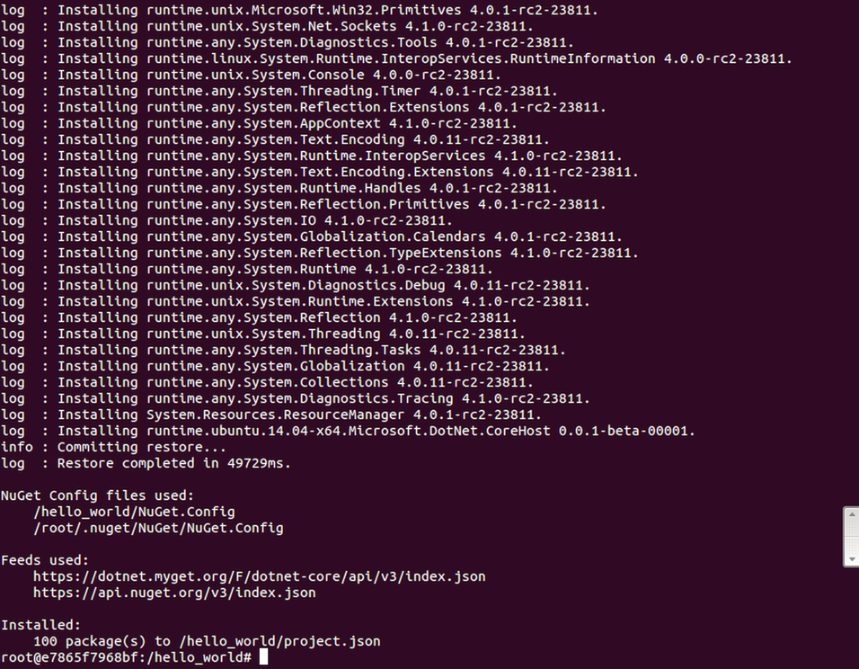
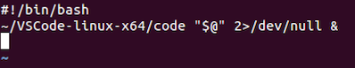
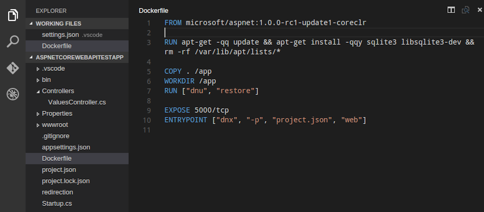
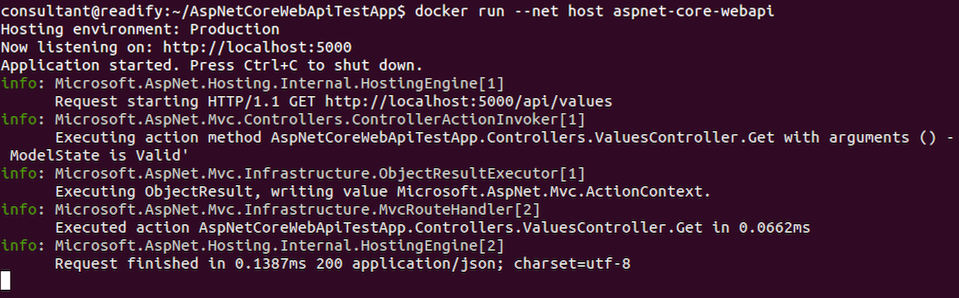

# Step 5 - LXC/Docker "Hello, world!"


## .NET Core on LXC/Docker on Ubuntu GNU/Linux 14.04.4 LTS

_What a mouthful..._

__Note:__ The following guide is really just a combo of [here](https://docs.docker.com/linux/) and [here](https://dotnet.github.io/getting-started/).

#### What is LXC (Linux Containers)?

> [LXC](https://en.wikipedia.org/wiki/LXC) ([Linux Containers](https://linuxcontainers.org/)) is an operating-system-level virtualization method for running multiple isolated Linux systems (containers) on a control host using a single Linux kernel.

#### What is Docker

> [Docker](https://en.wikipedia.org/wiki/Docker_(software)) is an open-source project that automates the deployment of applications inside software containers, by providing an additional layer of abstraction and automation of operating-system-level virtualization on Linux.

#### Installing Docker

Run the following to download and install the latest Docker package.

__Note:__ You may be prompted to supply your password for `sudo` this is ok.

```
curl -fsSL https://get.docker.com/ | sh
```


#### Allow Docker to run as your non-root user

We shouldn't need `root` to run Docker.

```
sudo usermod -aG docker consultant
```

> Remember that you will have to log out and back in for this to take effect!

Actually we'll need to reboot to make sure that `docker daemon` is running.

```
sudo reboot
```

#### Verify Docker is installed correctly

```
docker run hello-world
```


All is well.

#### Run the container using the dotnet base image

> The following command will get you a running container with the toolchain, straight off of [Microsoft's Docker Hub](https://hub.docker.com/r/microsoft/dotnet/).

> A [Docker Hub](https://www.docker.com/products/docker-hub) is a cloud hosted service from Docker that provides registry capabilities for public and private content.

```
docker run -it microsoft/dotnet:latest
```

__Note:__ This is a good time for a coffee break.



You may have noticed that you're no longer `consultant@readify` instead you are now `root@e7865f7968bf` (or something like that). This is because Docker has _sshed_ you into the running container. Yes it's that awesome and that fast.

#### Initialize some code

> Now that you are in a running container, let's initialize a sample Hello World application!

```
mkdir hello_world
```

```
cd hello_world
```

```
dotnet new
```


#### Run the application

> After the `dotnet new` command, the only thing we need is to restore the dependencies and run the application.

```
dotnet restore
```




```
dotnet run
```


#### Exiting your Docker container

```
exit
```


_Simples..._ ;)

There's a lot more to Docker than just running up a prebaked Docker image then scaffolding and running an application.

## Making Visual Studio Code available (a.k.a. the VIM crash-course)

Before we dig into Docker a little more let's make _Visual Studio Code_ easily available from the terminal. We added VS Code to our VM in [Step 2](Part2.md) so if you missed Step 2 you might need to go back and do at least the VS Code section.

#### Creating a user-specific `bin` folder

To avoid polluting `/bin` or `/usr/local/bin` let's create our own `bin` folder.

1. Run `mkdir ~/bin` to create a new `bin` directory in your `home` directory.

2. Run `vim ~/.bashrc` to edit your "Bash RC" file with `vim`.

3. Type `SHIFT+g` _(upper-case G)_ to go to the end of the file.

4. Type `o` _(lower-case o)_ to insert a new line at the end of the file.

  __Note:__ `vim` will automatically enter `-- INSERT --` mode.

5. Add the line `export PATH="/home/$USER/bin:$PATH"` to the end of the file.

6. Press `ESC` to exit _insert_ mode and enter _command_ mode.

7. Type `:wq` and hit `ENTER` to save (write) the file and quit `vim`.

__Woah!__ That was intense...

Let's take a quick look at the current value of our `PATH` environment variable.

```
echo $PATH | sed s/:/\\n/g
```


As you can see our new `bin` directory `/home/$USER/bin` is not yet in our `PATH`. We need to close and re-open our terminal for the `PATH` change to take effect so let's do that now.

```
echo $PATH | sed s/:/\\n/g
```


Now we can see that all is well.

#### "Linking" VS Code to our `bin` directory

Following the same basic process as above use the command `vim ~/bin/code` to create a new file in `~/home/$USER/bin` called `code` containing the following.

```
#!/bin/bash
~/VSCode-linux-x64/code "$@" 2>/dev/null &
```



Add the executable permission to `code` as follows.

```
chmod +x ~/bin/code
```


Run `code` to verify that everything has worked correctly.


__Excellent!__ You can close VS Code (for now).

## ASP.NET Core on LXC/Docker on Ubuntu GNU/Linux 14.04.4 LTS

Before we dig into ASP.NET Core on LXC/Docker let's learn about `Dockerfiles`.

#### Dockerfiles

> Docker can build images automatically by reading the instructions from a [Dockerfile](https://docs.docker.com/engine/reference/builder/). A `Dockerfile` is a text document that contains all the commands a user could call on the command line to assemble a [Docker image](https://docs.docker.com/engine/userguide/containers/dockerimages/). Using `docker build` users can create an automated build that executes several command-line instructions in succession.

Let's take a look at how we might build a `Dockerfile` for ASP.NET Core.

```
cd ~/AspNetCoreWebApiTestApp/ && code .
```

Great news! We already have a `Dockerfile` prepared for us by `Yeoman` and the ASP.NET Core team.


__Note:__ We need to be careful as the [default base image](https://hub.docker.com/r/microsoft/aspnet/) `microsoft/aspnet:1.0.0-rc1-update1` targets Mono not CoreCLR. The image we need is `microsoft/aspnet:1.0.0-rc1-update1-coreclr`. Let's update our `Dockerfile` accordingly.

Also let's __remove__ the following line as it's a duplicate from the [CoreCLR base image](https://github.com/aspnet/aspnet-docker/blob/master/1.0.0-rc1-update1-coreclr/Dockerfile).

```
RUN printf "deb http://ftp.us.debian.org/debian jessie main\n" >> /etc/apt/sources.list
```



#### Building your container and application

Let's take a look at our current list of Docker images.

```
docker images
```


We have the `hello-world` image and `microsoft/dotnet` image from earlier.

Next we want to run `docker build` to build our application container from the `Dockerfile`.

```
docker build -t aspnet-core-webapi:latest .
```

__Note:__ This is an excellent time for another coffee break.


Let's take another look at our updated list of Docker images.

```
docker images
```


We also now have the `microsoft/aspnet` and `aspnet-core-webapi` images.

Now let's run our application in our new container.

```
docker run --net host aspnet-core-webapi
```



Open Firefox and navigate to `http://localhost:5000` to confirm it is all working.


## End of step 5

__Done!__ You know how to LXC/Docker "all the things".

The rest _as they say_ is history...
