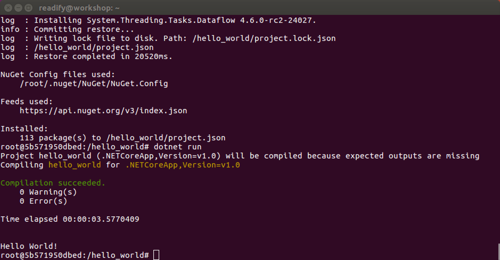
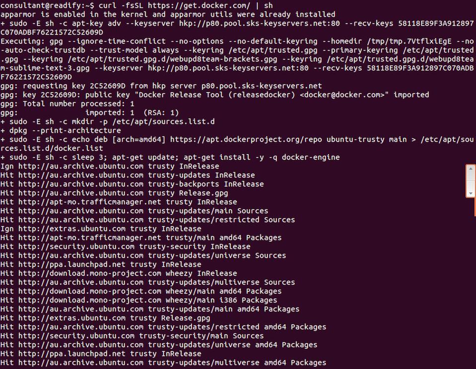
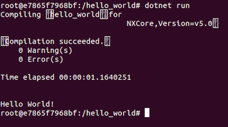
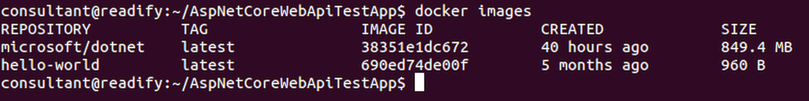

# 5. "Hello, world!" Docker

_**Note:** Apologies I ran out of time to screenshot and customise this section for the workshop..._


#### What is LXC (Linux Containers)?

> [LXC](https://en.wikipedia.org/wiki/LXC) ([Linux Containers](https://linuxcontainers.org/)) is an operating-system-level virtualization method for running multiple isolated Linux systems (containers) on a control host using a single Linux kernel.

#### What is Docker

> [Docker](https://en.wikipedia.org/wiki/Docker_(software)) is an open-source project that automates the deployment of applications inside software containers, by providing an additional layer of abstraction and automation of operating-system-level virtualization on Linux.

## Installing Docker 1.12 RC on Ubuntu Xenial 16.04 (LTS)

Follow the Ubuntu Xenial 16.04 (LTS) instructions [__here__](https://docs.docker.com/engine/installation/linux/ubuntulinux/) to install the Docker Engine 1.12 RC.

Keep going until you get to `sudo docker run hello-world` and you will see the following.


#### Optional Docker Configuration

Now continue on and complete the following  _optional configurations_ as they will make running Docker lower friction and more enjoyable for you.

1. [Create a docker group](https://docs.docker.com/engine/installation/linux/ubuntulinux/#create-a-docker-group) so you don't have to run Docker with `sudo`.

2. [Adjust memory and swap accounting](https://docs.docker.com/engine/installation/linux/ubuntulinux/#adjust-memory-and-swap-accounting) primarily to avoid getting spammed with warnings.

3. [Configure a DNS server for use by Docker](https://docs.docker.com/engine/installation/linux/ubuntulinux/#configure-a-dns-server-for-use-by-docker) so that you don't resolve everything via Google's public DNS servers.

4. [Configure Docker to start on boot](https://docs.docker.com/engine/installation/linux/ubuntulinux/#configure-docker-to-start-on-boot) so you don't have to remember to start it every time.

## .NET Core RC2 "Hello, world!" on Docker 1.12 RC

Follow the instructions [__here__](https://www.microsoft.com/net/core#docker) to test drive .NET Core RC2 on Docker Engine 1.12 RC.

Keep going until you get to `dotnet run` and you will see the following.




__TODO: (Tod)__ Continue on from here! :)


> _**Here be dragons! This rest of this section is probably out of date...**_

## (out of date...) Installing Docker 1.11 on Ubuntu Trusty 14.04 (LTS)

Run the following to download and install the latest Docker package.

__Note:__ You may be prompted to supply your password for `sudo` this is OK.

```
curl -fsSL https://get.docker.com/ | sh
```




#### Allow Docker to run as your non-root user

We shouldn't need `root` to run Docker.

```
sudo usermod -aG docker consultant
```

> Remember that you will have to log out and back in for this to take effect!

Actually we'll need to reboot to make sure that `docker daemon` is running.

```
sudo reboot
```

#### Verify Docker is installed correctly

```
docker run hello-world
```


All is well.

## (out of date) Running a .NET Core RC1 "base image"

> The following command will get you a running container with the toolchain, straight off of [Microsoft's Docker Hub](https://hub.docker.com/r/microsoft/dotnet/).

> A [Docker Hub](https://www.docker.com/products/docker-hub) is a cloud hosted service from Docker that provides registry capabilities for public and private content.

```
docker run -it microsoft/dotnet:latest
```

__Note:__ This is a good time for a coffee break.


You may have noticed that you're no longer `consultant@readify` instead you are now `root@e7865f7968bf` (or something like that). This is because Docker has _sshed_ you into the running container. Yes it's that awesome and that fast.

#### Initialize some code

> Now that you are in a running container, let's initialize a sample Hello World application!

```
mkdir hello_world
```

```
cd hello_world
```

```
dotnet new
```


#### Run the application

> After the `dotnet new` command, the only thing we need is to restore the dependencies and run the application.

```
dotnet restore
```


```
dotnet run
```



#### Exiting your Docker container

```
exit
```


_Simples..._ ;)

There's a lot more to Docker than just running up a prebaked Docker image then scaffolding and running an application.

## (out of date) ASP.NET Core RC1 on Docker on Ubuntu Linux

Before we dig into ASP.NET Core on Docker let's learn about `Dockerfiles`.

#### Dockerfiles

> Docker can build images automatically by reading the instructions from a [Dockerfile](https://docs.docker.com/engine/reference/builder/). A `Dockerfile` is a text document that contains all the commands a user could call on the command line to assemble a [Docker image](https://docs.docker.com/engine/userguide/containers/dockerimages/). Using `docker build` users can create an automated build that executes several command-line instructions in succession.

Let's take a look at how we might build a `Dockerfile` for ASP.NET Core.

```
cd ~/AspNetCoreWebApiTestApp/ && code .
```

Great news! We already have a `Dockerfile` prepared for us by `Yeoman` and the ASP.NET Core team.


__Note:__ We need to be careful as the [default base image](https://hub.docker.com/r/microsoft/aspnet/) `microsoft/aspnet:1.0.0-rc1-update1` targets Mono not CoreCLR. The image we need is `microsoft/aspnet:1.0.0-rc1-update1-coreclr`. Let's update our `Dockerfile` accordingly.

Also let's __remove__ the following line as it's a duplicate from the [CoreCLR base image](https://github.com/aspnet/aspnet-docker/blob/master/1.0.0-rc1-update1-coreclr/Dockerfile).

```
RUN printf "deb http://ftp.us.debian.org/debian jessie main\n" >> /etc/apt/sources.list
```


#### Building your container and application

Let's take a look at our current list of Docker images.

```
docker images
```



We have the `hello-world` image and `microsoft/dotnet` image from earlier.

Next we want to run `docker build` to build our application container from the `Dockerfile`.

```
docker build -t aspnet-core-webapi:latest .
```

__Note:__ This is an excellent time for another coffee break.


Let's take another look at our updated list of Docker images.

```
docker images
```


We also now have the `microsoft/aspnet` and `aspnet-core-webapi` images.

Now let's run our application in our new container.

```
docker run --net host aspnet-core-webapi
```


Open Firefox and navigate to `http://localhost:5000` to confirm it is all working.


