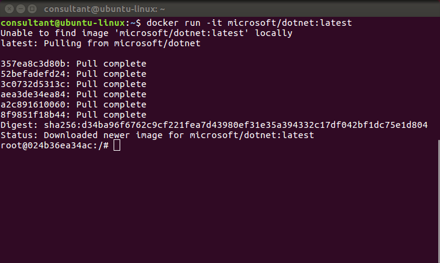
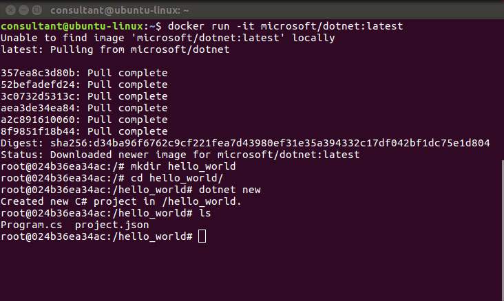
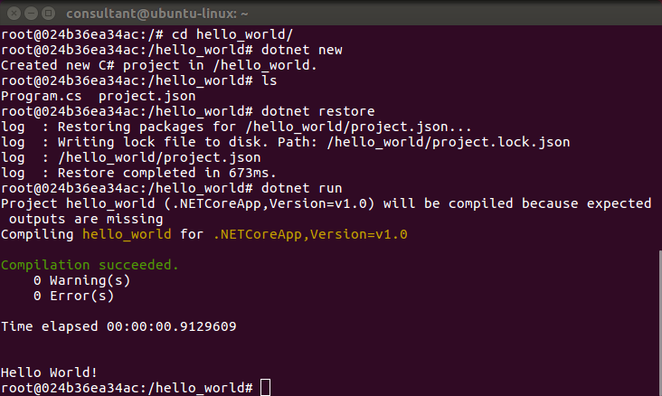
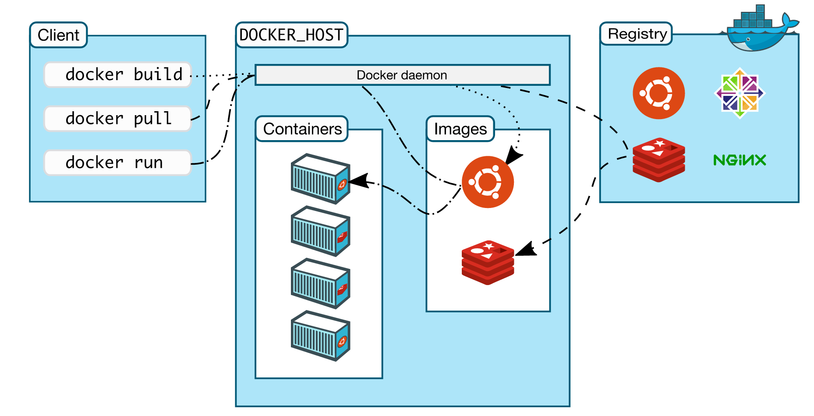
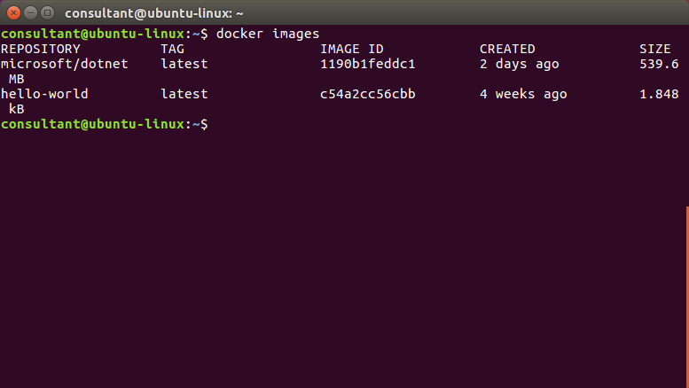
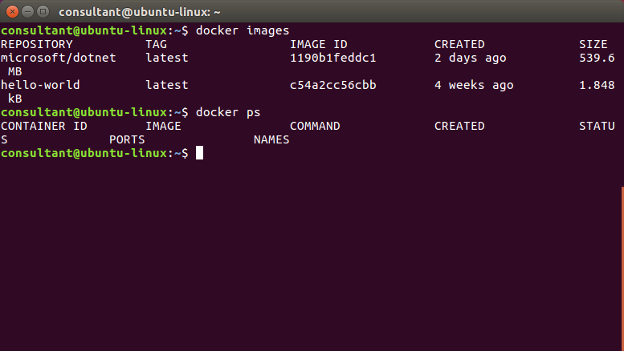
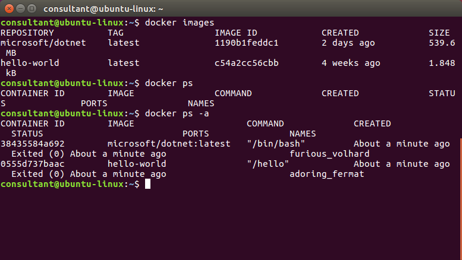
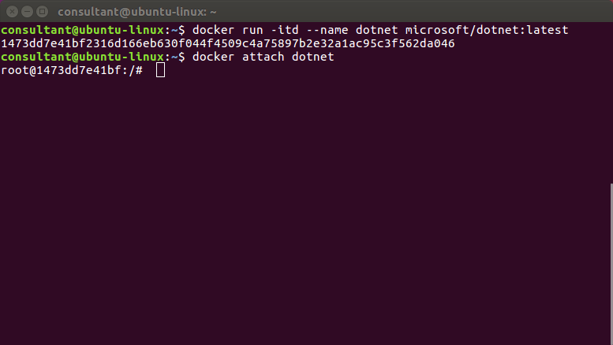
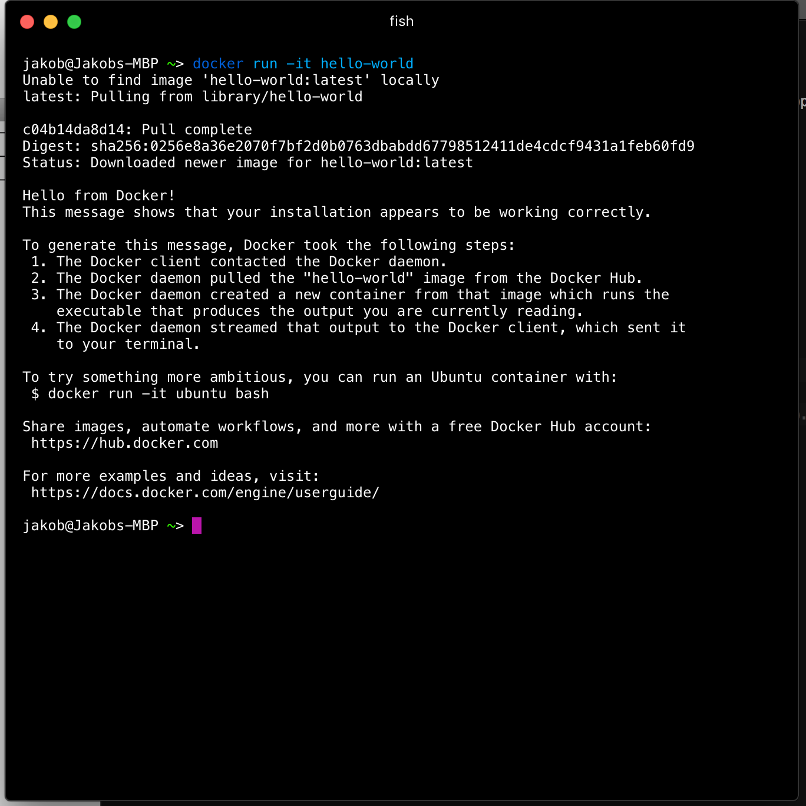
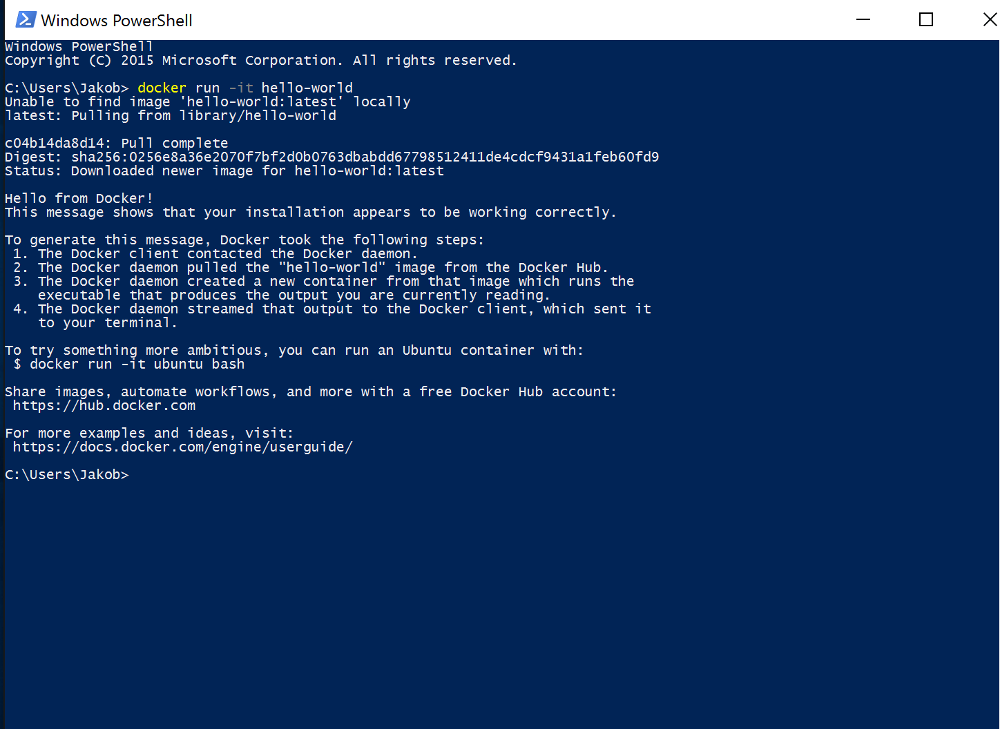

# 5. "Hello, world!" Docker

_**Note:** Apologies I ran out of time to screenshot and customise this section for the workshop..._


#### What is LXC (Linux Containers)?

> [LXC](https://en.wikipedia.org/wiki/LXC) ([Linux Containers](https://linuxcontainers.org/)) is an operating-system-level virtualization method for running multiple isolated Linux systems (containers) on a control host using a single Linux kernel.

#### What is Docker

> [Docker](https://en.wikipedia.org/wiki/Docker_(software)) is an open-source project that automates the deployment of applications inside software containers, by providing an additional layer of abstraction and automation of operating-system-level virtualization on Linux.

## Installing Docker 1.12 RC on Ubuntu Xenial 16.04 (LTS)

Follow the Ubuntu Xenial 16.04 (LTS) instructions [__here__](https://docs.docker.com/engine/installation/linux/ubuntulinux/) to install the Docker Engine 1.12 RC.

Keep going until you get to `sudo docker run hello-world` and you will see the following.


#### Optional Docker Configuration

Now continue on and complete the following  _optional configurations_ as they will make running Docker lower friction and more enjoyable for you.

1. [Create a docker group](https://docs.docker.com/engine/installation/linux/ubuntulinux/#create-a-docker-group) so you don't have to run Docker with `sudo`.

2. [Adjust memory and swap accounting](https://docs.docker.com/engine/installation/linux/ubuntulinux/#adjust-memory-and-swap-accounting) primarily to avoid getting spammed with warnings.

3. [Configure Docker to start on boot](https://docs.docker.com/engine/installation/linux/ubuntulinux/#configure-docker-to-start-on-boot) so you don't have to remember to start it every time.

## .NET Core "Hello, world!" on Docker 1.12 RC

Lets give .net core and Docker a go. First we'll get the latest dotnet docker image and run it.

```
docker run -it microsoft/dotnet:latest 
```



Create a new dotnet core app.

```
mkdir mynewapp
cd mynewapp
dotnet new
```




Restore the dependencies and run the app.

```
dotnet restore
dotnet run
```



__Superb!__ You now have your "Hello, world!" on both vanilla Docker and .NET Core on Docker.

## _All right stop, collaborate and listen!_

Now what just happed there!!! Well first of all, docker pulled down the latest```microsoft/dotnet``` image from docker hub and ran that in a new docker container with the ```-it``` switch. Let's go back a bit and explain some of the core components of Docker to better understand what that means.

### Docker 101

First 3 main concepts to understand, Images, Containers and Registry's

#### Images

> Docker images are the recipes for building containers. They are read-only and are usually composed of layers of other images with a base image of something like Ubuntu, Readh at or Debian. The layers are built from ```Dockerfile```'s, which are just a set of instructions of how to build the image.
 
#### Containers

> Docker containers are running/runnable instances of docker images. Think if images and containers like classes and objects.

#### Registry / Docker hub

> Docker registry's are repositories for docker images. The default public registry is the docker hub. Images are stored on the local host when pulled from the registry.



Docker itself is actually a client-server application where the client is the CLI application and the server is the docker daemon (like a windows service). The CLI is the users' way of sending commands to the server and the server then, in turn does the heavy lifting of pulling images from the registry and building containers. 

Going back to our initial command ```docker run -it microsoft/dotnet:latest```. 
Because we did not already have the image locally on the machine, docker will go to the docker hub registry and pull the image form there before building the container and running it.

#### Exploring the Docker CLI

We left our terminal inside the actual running container, let's exit that (just run ```exit```) and give a few of the basic docker CLI command a try.

First of all, let's have a look at the images available on the local machine.

```
docker images
```

You should see a list with 2 images like this



Next, let have a look at the running containers

```
docker ps
```



Hmm, no containers running, but we might have some stopped containers. Try running;

```
docker ps -a
```

This will give us all containers on the system, running or not.



When we started this exercise we started the the ```microsoft/dotnet``` container with the ```-it``` switch, now let's start it again but add a ```d``` to the switch

```
docker run -itd --name dotnet microsoft/dotnet:latest
```


This creates a new container and starts it but does not ```attach``` the console to it. Instead is just returned the id of the container. Try running ```docker ps``` to see that we now have a running container. To attach to the console of the running container run;

```
docker attach dotnet
```

__Protip__ to escape the container without stopping it, use the escape sequence Ctrl-p + Ctrl-q 



That's a bit of basic introduction to running docker commands, try to run

```
docker --help
```

And have a bit of a look around the possible commands. A few helpful commands for cleaning up could be:

Stop all containers:

```docker kill $(docker ps -q)```

Remove all containers:

```docker rm $(docker ps -a -q)```

Remove all docker images:

```docker rmi $(docker images -q)```


For more in-depth docker knowledge, have a log at the [docker docs](https://docs.docker.com/engine/understanding-docker/)

## Docker for Mac/Windows

Recently Docker has also been released for macOS and Windows. Both versions run the client part as native application to the host OS, but runs the Docker Engine part (daemon) through a hypervisor, Hyper-V on Windows and [xhyve](https://github.com/mist64/xhyve/) on macOS. You can find a more elaborate description of how to use and download it, for mac [here](https://docs.docker.com/docker-for-mac/) and for Windows [here](https://docs.docker.com/docker-for-windows/)


#### Running "hello_world" on macOS on Docker



#### Running "hello_world" on Windows on Docker




## Kitematic (beta)

Kitematic is a useful GUI application for managing Docker image and containers on macOS and Windows, description from the Docker docs:

> Kitematic is an open source project built to simplify and streamline using Docker on a Mac or Windows (coming soon) PC. Kitematic automates the Docker installation and setup process and provides an intuitive graphical user interface (GUI) for running Docker containers. Kitematic integrates with Docker Machine to provision a VirtualBox VM and install the Docker Engine locally on your machine.


## End of Part 5


Step 6a (more dotnet core) or step 6b (more docker) 

