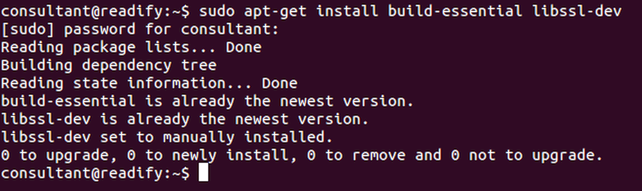
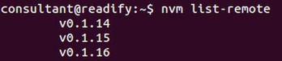
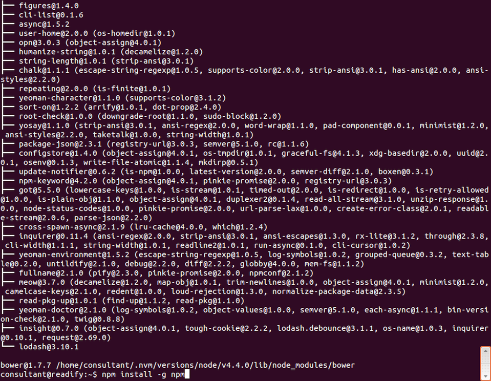
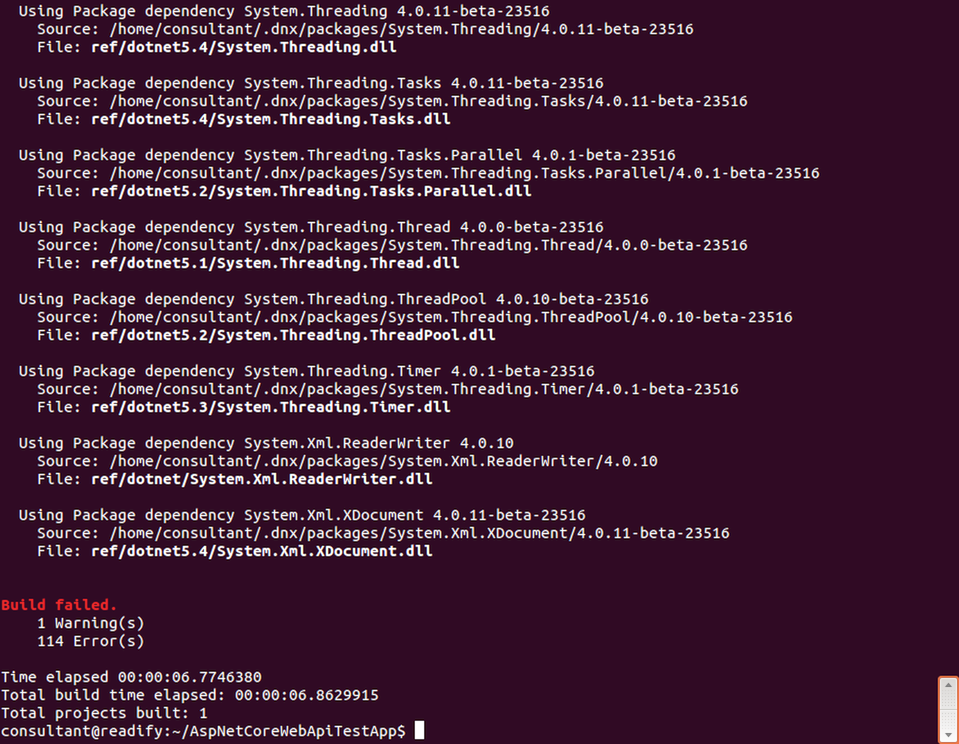

# 6. "Hello, world!" Node.js and Yeoman


## Installing Node.js (via NVM)

We'll be using Node.js to scaffold our ASP.NET Core application via [Yeoman](http://yeoman.io/).

```
sudo apt-get install build-essential libssl-dev
```



```
curl -o- https://raw.githubusercontent.com/creationix/nvm/v0.31.0/install.sh | bash
```


__Note:__ Close and reopen your terminal to start using `NVM`.

Let's take a look to see which versions of Node.js we have installed.

```
nvm list
```


You guessed it, we don't have _any_ version of Node.js. Take a look at the versions of Node.js that are available to us.

```
nvm list-remote
```




Now we can install the latest LTS version of Node.

```
nvm install v4.4.0
```


Let's confirm that Node and NPM are installed.

```
node -v && npm -v
```


> Awesome! Oh wow! Like totally... ;)

#### Install Yeoman

> Yeoman is the web's scaffolding tool for modern webapps.

```
npm install -g gulp grunt-cli bower yo
```




#### Upgrade NPM

Yeoman is recommending that we upgrade NPM so let's do that.

```
npm install -g npm
```


#### Install the Yeoman ASP.NET Core generators

__Note:__ Yeoman generators are just regular NPM packages.

```
npm install -g generator-aspnet
```


#### Initialise some code

Now we're going to scaffold a new __ASP.NET Core Web API__ application.

```
yo aspnet
```


As directed run the following commands to test your newly scaffolded application.

```
cd AspNetCoreWebApiTestApp
```

```
dnu restore
```


So far so good. Let's see what's next.

```
dnu build
```




That's not awesome. The first screenshot above should make the fix obvious. For some background information [see here](https://github.com/aspnet/Home/issues/1104).

```
dnu build --framework dnxcore50
```


__Note:__ Another option is to remove the line `"dnx451": {},` from the `frameworks` section of `project.json`.

#### Run the application

Running the application is simple.

```
dnx web
```


Open Firefox and navigate to `http://localhost:5000/api/values` to see your new _Web API_ in action.


