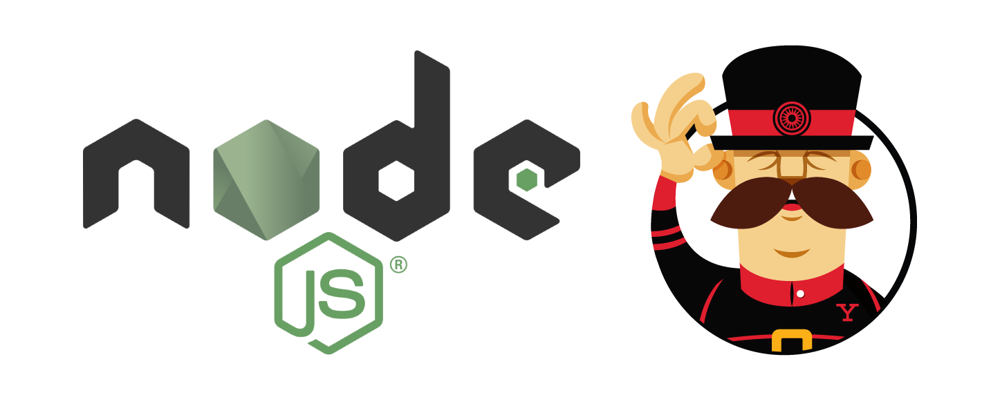
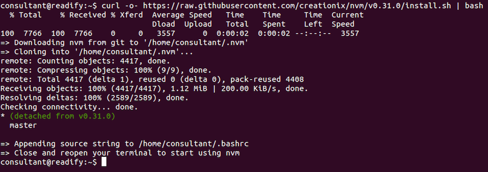
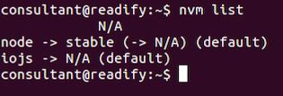
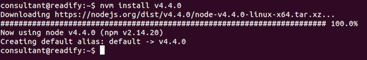
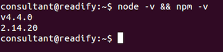
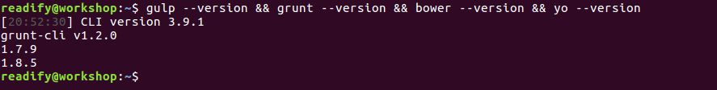
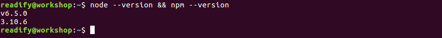
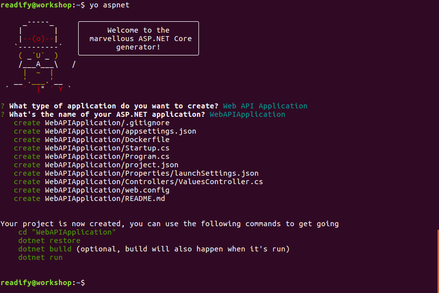
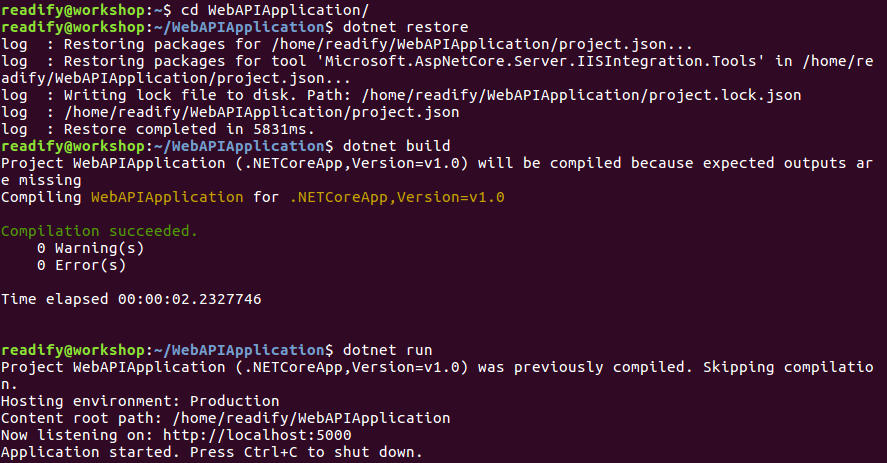
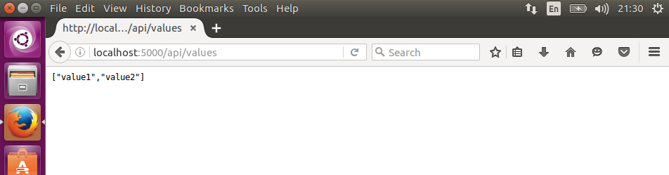

# 6. "Hello, world!" via Node.js & Yeoman

What is [Node](https://nodejs.org)?

> Node.js® is a JavaScript runtime built on Chrome's V8 JavaScript engine. Node.js uses an event-driven, non-blocking I/O model that makes it lightweight and efficient. Node.js' package ecosystem, npm, is the largest ecosystem of open source libraries in the world.

What is [Yeoman](http://yeoman.io)?

> Yeoman helps you to kickstart new projects, prescribing best practices and tools to help you stay productive.



We'll be using [Node](https://nodejs.org) to scaffold a new ASP.NET Core application via [Yeoman](http://yeoman.io/).

## Installing Node.js (via NVM)

We are going to use [NVM](https://github.com/creationix/nvm) (Node Version Manager) to install Node. The advantage of using NVM to install Node is that you will be able to run as many versions of node "in parallel" as you like. For example you might like to use a different version of Node for each Node (JavaScript) application.

Run the following to install a couple of prerequisite dependencies we'll need.

```
sudo apt-get install build-essential libssl-dev
```


Run the following to install `nvm`.

```
curl -o- https://raw.githubusercontent.com/creationix/nvm/v0.31.7/install.sh | bash
```



__Note:__ Close and reopen your terminal to start using `nvm`.

Let's take a look to see which versions of Node we have installed.

```
nvm list
```



You guessed it, we don't have _any_ version of Node. Take a look at the versions of Node that are available to us.

```
nvm list-remote
```


Now we can install the latest version of Node.

```
nvm install v6.5.0
```



Let's confirm that `node` and `npm` are installed and available.

```
node --version && npm --version
```



## Installing Yeoman

> Yeoman is the web's scaffolding tool for modern webapps.

We are also going to install a number of JavaScript tools that will be aid us in scaffolding ASP.NET Core applications.

Run the following to install [Gulp](http://gulpjs.com), [Grunt](http://gruntjs.com), [Bower](https://bower.io) and [Yeoman](http://yeoman.io.)

__Note:__ If you aren't familiar with some or all of these tools, please take a few minutes to read up on them if you like.

```
npm install -g gulp grunt-cli bower yo
```


Let's confirm that `gulp`, `grunt`, `bower` and `yo` are installed and available.

```
gulp --version && grunt --version && bower --version && yo --version
```



### Upgrading NPM

Yeoman is (might be) recommending that we upgrade `npm` so let's do that.

```
npm install -g npm
```


We are now tracking and updating `npm` with `npm`.

Run `node --version && npm --version` again to verify `npm` has been upgraded.



### Installing the Yeoman ASP.NET Core generators

Next we'll install the [Yeoman generators for ASP.NET Core](https://github.com/omnisharp/generator-aspnet#readme). These generators will allow us to generate projects and snippets in a similar way to what we are used to with Visual Studio.

Project templates are available for the following types of projects:

- `emptyweb` for Empty Web Application
- `consoleapp` for Console Application
- `web` for Web Application
- `webbasic` for Web Application Basic
- `webapi` for Web API Application
- `nancy` for Nancy ASP.NET Application
- `classlibrary` for Class Library
- `unittest` Unit Test project (xUnit.net)
- `bootstrap` for Bootstrap (this is the default)
- `semantic` for Semantic UI

There are also a large number of [sub-generators available](https://github.com/OmniSharp/generator-aspnet/blob/master/README.md#sub-generators), including but not limited to the following.

* Angular (Controllers, Directives, Factories, Modules, etc)
* ASP.NET MVC (Controllers, Views, etc)
* CoffeeScript
* CSS
* Dockerfiles
* Gulp files
* HTML
* Interfaces
* JavaScript
* JSX
* TypeScript

__Note:__ Yeoman generators are just regular `npm` packages.

```
npm install -g generator-aspnet
```


### Scaffolding a new ASP.Net Core Web API

Now we're going to scaffold a new __ASP.NET Core Web API__ application.

```
yo aspnet
```



Next, run the commands as directed to test your newly scaffolded application.

```
cd "WebAPIApplication"
```

```
dotnet restore
```

```
dotnet build
```

```
dotnet run
```

Once you execute `dotnet run` you should see the following output.



Open a browser to `http://localhost:5000/api/values` and confirm your newly scaffolded ASP.NET Core Web API application is working.



## _All right stop, collaborate and listen!_

OK here's what you need to do next. I have left the following intentionally vague so that you'll have some investigation to do. I would suggest taking a look at all the files in the scaffolded application directory to familiarise yourself before continuing.

1. Add `.UseUrls("http://*:5000")` to the fluent configuration in order to configure Kestrel to bind on all network interfaces.

2. Take a close look at the `Dockerfile` and the [Dockerfile reference](https://docs.docker.com/engine/reference/builder/).

3. Use `docker build --help` and the `Dockerfile` to build a new container for your application tagged with the tag `yourname/yourapp` e.g. `todthomson/pwnerer`.

4. See if you can specify a `name` when using `docker run`.

4. Work out how to `docker run` and bind port `5000` in a docker container to port `5000` on the host.

5. Try using `docker run` and mount the local application directory e.g. `/home/readify/WebAPIApplication` to the directory `/app` in the Docker container.

6. Fix up the `Dockerfile` to build the container without copying in the local directory `.` contents.

7. Put the above together to achieve an end-to-end development process from local filesystem into the container then back to the local browser.

## End of Part 6

__Completed!__ This concludes the formal part of this workshop.

Take a 5 minute break and then [return home](README.md) to attempt some extension exercises.
