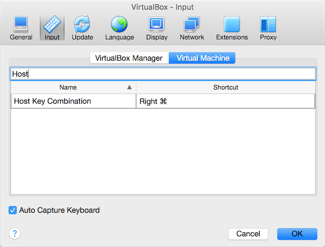

# Step 1 - GNU/Linux Installation

First we'll get a basic GNU/Linux installation up and running.

## Prerequisites

1. Download the latest [Ubuntu Desktop 14.04.4 LTS 64-bit ISO](https://launchpad.net/ubuntu/+cdmirrors) (i.e. `ubuntu-14.04.4-desktop-amd64.iso`) from your local Ubuntu mirror to save your quota and to download it as fast as possible. We're using 14.04.4 LTS as it's the primary GNU/Linux distribution (and version) being used by the .NET Core team.

2. Download the latest [VirtualBox installer](https://www.virtualbox.org/wiki/Downloads) for your operating system of choice (e.g. for Mac OS X `VirtualBox-5.0.14-105127-OSX.dmg`). Also download the corresponding version of the [extension pack](https://www.virtualbox.org/wiki/Downloads) (e.g. for all operating systems `Oracle__VM__VirtualBox__Extension__Pack-5.0.14-105127.vbox-extpack`). This extension pack contains drivers for USB etc.

## Installing and configuring VirtualBox

1. Install VirtualBox by following the prompts. You should include __all__ options.

2. Double-click the VirtualBox extension pack and __accept__ to install. VirtualBox should now be open.

3. Open VirtualBox __Preferences... => Input => Virtual Machine__ and update the __Host Key Combination__ to _Right COMMAND_ if you're on Mac or _Right CTRL_ if you're on non-Mac hardware.

  

## Creating the new VM

1. CLick __New__ in VirtualBox to begin the process of creating your new VM.

2. Give your VM a __name__ (e.g. Ubuntu), select __type__ _Linux_, __version__ _Ubuntu (64-bit)_ and then click __continue__.

3. Determine how much memory (RAM) to dedicate to your VM. I recommend a minimum of `2048MiB` and a maximum of `50%` of your host's physical memory e.g. in my case I have a MacBook Pro with `16GiB` of memory so I chose to configure my new VM with `4096MiB` of memory. Then click __continue__.

4. Leave the option _Create a virtual hard disk now_ in place and click __continue__.

5. Leave the option _VDI (VirtualBox Disk Image)_ in place and click __continue__.

6. Leave the option _Dynamically allocated_ in place and click __continue__.

7. Determine the maximum size for your __dynamically allocated disk__. I recommend setting this to a reasonable size which is less than the currently available space on the host disk e.g. in my case I have `182GiB` free so I set the maximum disk size to `128GB`. The other option is to set it to `2TB` and monitor actual `.vdi` file size yourself. This maximum size can be altered later via the command line tools so it's not _set in stone_.

8. Once you are happy with all your settings click __create__ to build your new VM and VHDD.

## Configuring your new VM

Now you have a new __powered off__ VM we want to update the configuration using some more optimal defaults prior to installing Linux. Click __settings__ to configure your new VM.

#### General => Advanced

1. Set __shared clipboard__ and __drag'n'drop__ to _bidirectional_.

#### System => Motherboard

1. Set __boot order__ to a) _floppy_ b) _network_ c) _optical_ d) _hard disk_ then disable _floppy_ and _network_.

2. Set __chipset__ to _ICH9_.

3. Set __pointing device__ to a setting which matches your host hardware e.g. I'm on a `2015 MacBook Pro` so I set it to _USB multi-touch tablet_.

#### System => Processor

1. Determine how many __Processor(s)__ to assign to your new VM. I recommend a minimum of `1` and a maximum of `half the number` of logical CPU cores of your host machine e.g. in my case I have a `2015 MacBook Pro` with `4 physical / 8 logical` CPU cores, so I _could_ set the virtual CPU cores to `4`, but I only selected `1` as that's all I will need for this tutorial.

2. Check __enable PAE/NX__.

#### System => Acceleration

1. Set __paravirtualization interface__ to _KVM_ which is the recommended setting for Linux guests. When using a Windows guest you should set __paravirtualization interface__ to _Hyper-V_.

  > VirtualBox allows exposing a paravirtualization interface to facilitate accurate and efficient execution of software within a virtual machine. These interfaces require the guest operating system to recognize their presence and make use of them in order to leverage the benefits of communicating with the VirtualBox hypervisor.

  > Most mainstream, modern guest operating systems, including Windows and Linux, ship with support for one or more paravirtualization interfaces. Hence, there is typically no need to install additional software in the guest (including VirtualBox Guest Additions) to make use of this feature.

  > Exposing a [paravirtualization provider](https://www.virtualbox.org/manual/ch10.html#gimproviders) to the guest operating system does not rely on the choice of host platforms. For example, the Hyper-V paravirtualization provider can be used for VMs to run on any host platform (supported by VirtualBox) and not just Windows.

__Note:__ The option __default__ _should_ have the same effect i.e. _default_ will automatically set the optimal __paravirtualization interface__ setting dependent on host operating system.

#### Display => Screen

1. Increase the __video memory__ to the maximum available setting. In my case this is `128MB`.

2. If you have a _retina_ display then check __use unscaled HiDPI Output__.

3. Check __enable 3D acceleration__.

#### Storage

1. Remove the __empty__ virtual optical drive from the __storage tree__ by selecting it and then clicking the _subtract disk_ icon at the bottom (second from the left).

2. Remove the virtual __controller: ide__ from the __storage tree__ by selecting it and then clicking the _subtract controller_ icon at the bottom (the rightmost icon).

3. Add a new virtual optical drive by selecting __controller: sata__ and clicking the _add disk_ icon at the bottom (the leftmost icon). When the modal appears click __choose disk__ and select `ubuntu-14.04.4-desktop-amd64.iso` downloaded earlier. Also check __use host i/o cache__.

4. If your host has an SSD select __Ubuntu.vdi__ and check __solid-state drive__.

#### Audio

1. Set __audio controller__ to _Intel HD Audio_.

#### Network => Adapter 1

1. Expand the __advanced__ section and set the __adapter type__ to _paravirtualized network (virtio-net)_.

  > [Virtio](http://wiki.libvirt.org/page/Virtio) is a virtualization standard for network and disk device drivers where just the guest's device driver "knows" it is running in a virtual environment, and cooperates with the hypervisor. This enables guests to get high performance network and disk operations, and gives most of the performance benefits of paravirtualization.

2. If you are on "wired network" (e.g. ethernet) set __attached to__ to _bridged adapter_. If you're on a "wireless network" (e.g. `802.11abgn` or `4G` etc) leave __attached to__ as _NAT_ as a lot of wireless access points will not allow multiple DCHP allocations to the same physical device (so the virtual device will fail to get an IP address).

#### Ports => USB

1. Select __USB 3.0 (xHCI) Controller.

__Done!__ Click __OK__ to save the VM settings.

## Booting your new VM and installing Linux

1. Double-click your new VM labelled __Ubuntu => Powered Off__ to boot the VM and begin the installation.

  > While your new VM is booting into the installation screen, if your are using a host with a "retina" screen select __View => Scale Factor => 200%__ so you can actually see your VM while it's installing.

2. Once you arrive at the first screen labelled __Install (as superuser)__ click _Install Ubuntu_.

3. Make sure you have __three green ticks__ then check _download updates while installing_. If you want to be able to play patented audio formats you should also check _install this third-party software_. Once you're happy click _continue_.

4. To keep things simple leave the default option __Erase disk and install Ubuntu__ in place and click _install now_.

5. Confirm the partition table changes by clicking _continue_.

6. _Where are you?_ should have automatically detected and configured your location via the Internet. If this didn't happen stop and check the "up and down" arrows in the task bar (top right corner) to confirm you have internet access through _NAT_ or _Bridged Mode_ via the host. If you don't have any Internet access that's OK just type in to the autocomplete the name of your closet capital city e.g. _Brisbane (Queensland, Australia)_ or your timezone e.g. _Lord Howe Time (Australia)_ and then click _continue_.

7. Leave the left pane set to __English (US)__. If you're using Windows hardware also leave the right pane set to __English (US)__. If you're using Mac hardware select __English (US) - English (Macintosh)__ in the right pane. Then click on _continue_.

8. _Who are you?_ Use the following guide to fill in these details:

  a. __Your name:__ e.g. Tod Nicholas Thomson

  b. __Your computer's name:__ e.g. apsalar

  > __See:__ [RFC1178](https://tools.ietf.org/html/rfc1178) or __TL;DR__ Use all lower case (Unix is case-sensitive). Don't use random combinations of letters and numbers that "encode" some information about the location or function of the computer which are hard to "talk about". At the other end of the spectrum don't use names that will clash or sound like real people's names.

  c. __Pick a username:__ e.g. tnt

  > The "Unix way" is to use all your initials for your username. You need to type your username a lot so it's good for it to be short.

  d. __Choose a password__ and __confirm your password__. You will need to remember this password as you'll need it when you want to run things as _root_ (administrator).

  e. For ease of use (and as this is just a VM) select __log in automatically__.

  f. Click __continue__ to begin the process of installing your new Linux system.

  __Note:__ While you wait, expand the lower section to take a look at the installation _under the hood_. Also _use the left and right arrows_ to explore some user-facing parts of your new Ubuntu install.

9. Once see the message __installation complete__ click _restart now_.

## End of step 1

Congrats! You now have a Linux VM! :)

Take a 5 minute coffee break and then head over to [Step 2 - Ubuntu GNU/Linux Configuration & Maintenance](Step2.md).
