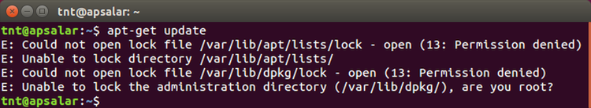
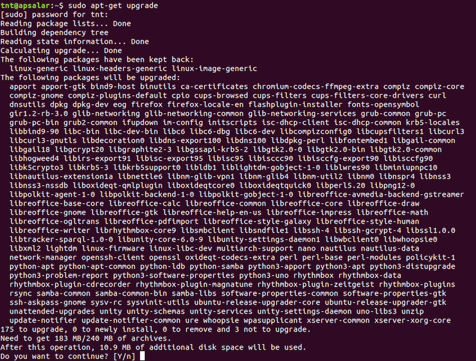
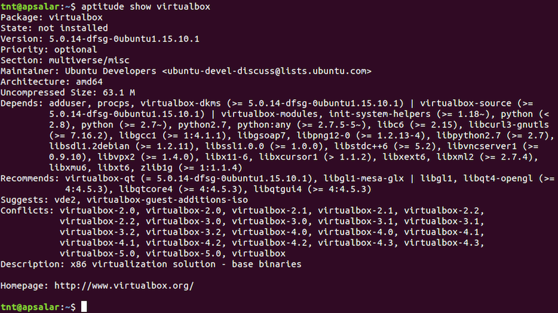
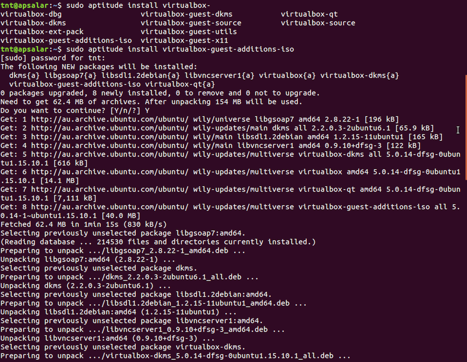
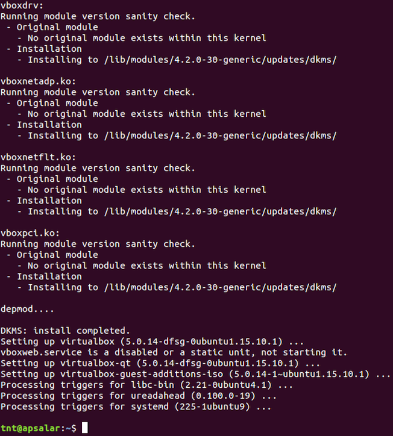
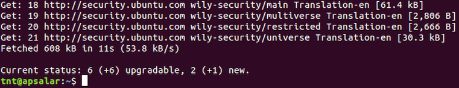

# Step 2 - GNU/Linux Configuration & Maintenance

Now we have a basic [Ubuntu](http://www.ubuntu.com/) [GNU/Linux](https://en.wikipedia.org/wiki/GNU/Linux_naming_controversy) installation up and running we'll look a few basic pieces of installation and configuration that will make your life easy.

## Background

Before we begin here's a little background.

#### Debian packages

[Debian](https://www.debian.org/) is the upstream distribution of Ubuntu. Debian packages exist as either binary or source packages with the [`.deb`](https://en.wikipedia.org/wiki/Deb_(file_format)) extension. Under the hood [.deb] packages contain two [`.tar`](https://en.wikipedia.org/wiki/Tar_(computing)) archives with optional compression. The program handling the configuration, installation and removal of Debian packages is [`dpkg`](https://en.wikipedia.org/wiki/Dpkg).

#### APT (the Advanced Packaging Tool)

The [Advanced Packaging Tool](https://en.wikipedia.org/wiki/Advanced_Packaging_Tool) APT is the "package manager" of Debian GNU/Linux and its variants (e.g. Ubuntu). It provides for the (almost) completely-automated discovery, retrieval, configuration, installation and removal of both binary and source packages. APT is wrapper around `dpkg` adding useful extra functionality like automated package download, bulk package update, automatic package dependency tree resolution, etc...

#### Aptitude

> Aptitude has Super Cow Powers

Yes. It is true. Aptitude has Super Cow Powers. Never. Forget. This. Ever.

[Aptitude](https://wiki.debian.org/Aptitude) is an [ncurses](https://en.wikipedia.org/wiki/Ncurses)-based terminal front-end to to APT. It also contains a "like for like" CLI-wrapper around `apt-get` and `apt-cache` e.g. `apt-get install foo` is the same as `aptitude install foo` and so on...

_But why should I care?_ When you install package X `aptitude` (via `apt-get`) will recursively install all dependencies (same for both `apt-get` or `aptitude`). Then when you remove package X down the line with `aptitude` it will _automatically recursively remove all the parent package dependencies_ without breaking other applications that are also using those dependencies or removing dependencies that you have explicitly installed previously. There are more reasons to prefer `aptitude` to `apt-get`, but this is all I will say about it for now.

## Updating your new system

Time to switch back to our Ubuntu GNU/Linux VM.

If GUI application [Software Updater](https://wiki.ubuntu.com/SoftwareUpdates) is open (it opens automatically on startup if there are updates) then close it. We're going to use the terminal-based update system (described above) to update our system now.

1. Open a new `Terminal` by pressing the `SUPER` (Windows) key, typing `term` and then pressing `ENTER`. This is how you launch applications in Ubuntu GNU/Linux i.e. it's the same as in Windows.

2. Once a new Terminal has opened run `apt-get update` to update to the latest package definition list. You should see the following error message:

  

3. So we _need root_ eh? Indeed. Root is the _super user_ (administrator) on all Unix variants. Let's try our command again but this time we'll preface it with the `sudo` (super-user do) command to run it "as root". Run the command `sudo apt-get update` and let's see what happens:

  

4. You will see that you are prompted for your password (not the root password) to confirm that you are in the list of _sudoers_ i.e. the list of users who have been granted the ability to run commands "as root" by the super user. The first account created as part of the installation gets sudoers access automatically.

5. Now that we have an up-to-date package definition list we can run `sudo apt-get upgrade` to upgrade our system to the latest packages and security updates:

  

6. Once `sudo apt-get upgrade` has completed running you should see that it has "done" its job successfully:

  

7. Now we have an up-to-date Ubuntu system let's `sudo apt-get install aptitude` the _super-cow-powered GUI_ on top of `apt-get`.

## VirtualBox configuration

Super! But we're running in a VM (on VirtualBox) so we really should take a step back and install the _VirtualBox Guest Additions_.

1. Because we're clever we'll use `aptitude` to make this easy for us. Just for interest let's run `aptitude show virtualbox`.

  

2. You can see that the `virtualbox` package is actually the VirtualBox VM which is not what we want on this occasion. The suggests line clues us in to what we _actually_ need so let's `sudo aptitude install virtualbox-guest-additions-iso`. You can use _tab completion_ to make your life easier i.e. if you type `sudo aptitude install virtualbox-<TAB>` you can trigger the autocompletion.

  
  

3. Unfortunately that's not enough to get the _shared clipboard_ and _drag and drop_ support working so let's `sudo aptitude install virtualbox-guest-dkms` to add that support. DKMS is the _Dynamic Kernel Module Support_ in the Linux kernel.

4. Now we have the _VirtualBox Guest Additions_ and the _VirtualBox Guest DKMS_ tools et al installed we need to `sudo reboot` for them to take effect.

Awesome. OK let's test this out. Try resizing the guest window and see what happens... We now have dynamic window sizing (and all the other things that come with it e.g. copy and paste support).

## Adding some useful programs

OK so what's next? Let's install some general programs we'll need later.

  1. We'll need `git` for sure, so let's `sudo aptitude install git`.

  2. We'll need a text editor and I'm a `vim` man so let's `sudo aptitude install vim`.

  3. If you prefer `emacs` you could `sudo aptitude install emacs` and then add the awesome [spacemacs](https://github.com/syl20bnr/spacemacs) distribution like so `git clone https://github.com/syl20bnr/spacemacs ~/.emacs.d && emacs --insecure`.

  4. So we have even more text-editing options let's install _Sublime Text 3_. There are two options for doing this which I will use to illustrate some other ways of getting software installed over and above _just downloading a binary_.

    1. Our first option is to download a `.dpkg` from the [Sublime Text 3](https://www.sublimetext.com/3) homepage and then install it using the `dpkg -i` command i.e. run the `wget https://download.sublimetext.com/sublime-text_build-3103_amd64.deb && sudo dpkg -i sublime-text_build-3103_amd64.deb` command.

    2. Our second (and the better) option is to use the _Sublime Text 3 Installer PPA_. A [PPA](https://en.wikipedia.org/wiki/Personal_Package_Archive) is a _Personal Package Archive_ which is simply just an unofficial APT repository hosted by an individual on Canonical's [Launchpad](https://launchpad.net/) software collaboration service. Run the following commands to install Sublime Text 3 using the PPA.

      > [Canonical](http://www.canonical.com/) is the company behind the Ubuntu GNU/Linux distribution.

      ```
      sudo add-apt-repository ppa:webupd8team/sublime-text-3
      ```

      

      ```
      sudo aptitude update
      ```

      

      ```
      sudo aptitude install sublime-text-installer
      ```

      

  3. Now run `subl` to confirm that Sublime Text 3 is available and working ok.

## End of step 2

Good job! You are now in possession of a configured and maintainable Linux VM! :)

Have some morning tea and then head over to [Step 3 - .NET Core "Hello, world!"](Step3.md).
