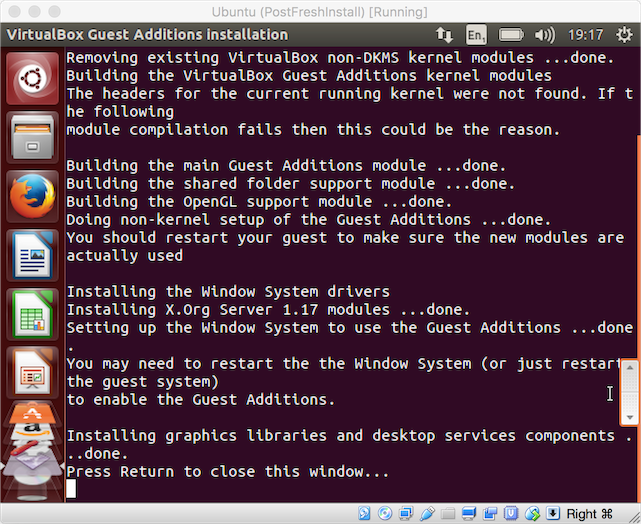

# Step 2 - GNU/Linux Configuration & Maintenance


Now we have a basic [Ubuntu](http://www.ubuntu.com/) [GNU/Linux](https://en.wikipedia.org/wiki/GNU/Linux_naming_controversy) installation up and running we'll look a few basic pieces of installation and configuration that will make your life easy.

## Background

Before we begin here's a little background.

#### Debian packages

[Debian](https://www.debian.org/) is the upstream distribution of Ubuntu. Debian packages exist as either binary or source packages with the [`.deb`](https://en.wikipedia.org/wiki/Deb_(file_format)) extension. Under the hood [.deb] packages contain two [`.tar`](https://en.wikipedia.org/wiki/Tar_(computing)) archives with optional compression. The program handling the configuration, installation and removal of Debian packages is [`dpkg`](https://en.wikipedia.org/wiki/Dpkg).

#### APT (the Advanced Packaging Tool)

The [Advanced Packaging Tool](https://en.wikipedia.org/wiki/Advanced_Packaging_Tool) APT is the "package manager" of Debian GNU/Linux and its variants (e.g. Ubuntu). It provides for the (almost) completely-automated discovery, retrieval, configuration, installation and removal of both binary and source packages. APT is wrapper around `dpkg` adding useful extra functionality like automated package download, bulk package update, automatic package dependency tree resolution, etc...

## Ironing out the wrinkles

Time to switch back to our Ubuntu GNU/Linux VM.

> Whoa! That's one teeny tiny VM!

Yes. Yes it is. But let's fix it anyhow ;)

#### VGA just ain't what it used to be...

> Come on Tod it's 2016 this GNU/Linux thing is supposed to be easy!

Not always my young Padawans, not always... But here's how you can fix it.

1. Open a new Terminal by pressing the shortcut `CTRL+ALT+T` or by pressing the `SUPER` (Windows) key, typing `term` and then pressing `ENTER`. This is how you launch applications in Ubuntu GNU/Linux i.e. it's the same as in Windows.

2. Run the following command to install some tools we will use for compiling some kernel modules build and testing our OpenGL acceleration is working:

  ```
  sudo apt-get install mesa-utils
  ```

  ```
  sudo apt-get install dkms build-essential linux-headers-$(uname -r)
  ```

3. Mount the _VirtualBox Guest Additions ISO_ by selecting __Devices => Insert Guest Additions CD image...__.

4. Once you see the following prompt select __run__ to begin the process.

  

5. Enter your _password_ and select __Authenticate__ to run the installation script as _root_.

  

6. You should see the following output indicating you've succeeded.

  

7. Press `ENTER` to close the terminal.

8. Open a new terminal and run `sudo reboot` to restart your VM.

After reboot you might notice that your VM is running at a higher resolution. The good news is that we can now run at Ubuntu's minimum resolution... ;)

To confirm that everything's working OK do the following:

1. Open _System Settings_ by pressing the `SUPER` (Windows) key, typing `s` and then hitting `ENTER`.

2. Open the _Screen Display_ option and then select whichever resolution takes your fancy. I selected `1024x768` which in "retina mode + 200% scale factor" will be `2048x1536` size-wise.

3. Run `glxgears`. If the "world falls over" then shut down your VM `sudo shutdown -h now` and reconfigure your VM to deselect __enable 3D acceleration__. Start your VM again and re-run `glxgears` to make sure all is now well.

__Note:__ See [VirtualBox ticket 12941](https://www.virtualbox.org/ticket/12941) for more information.

## Updating your new system

If GUI application [Software Updater](https://wiki.ubuntu.com/SoftwareUpdates) is open (it opens automatically on startup if there are updates) then close it. We're going to use the terminal-based update system (described above) to update our system now.

1. Open a new Terminal and run `apt-get update` to update to the latest package definition list. You should see the following error message:

  

2. So we _need root_ eh? Indeed. Root is the _super user_ (administrator) on all Unix variants. Let's try our command again but this time we'll preface it with the `sudo` (super-user do) command to run it "as root". Run the command `sudo apt-get update` and let's see what happens:

  

3. You will see that you are prompted for your password (not the root password) to confirm that you are in the list of _sudoers_ i.e. the list of users who have been granted the ability to run commands "as root" by the super user. The first account created as part of the installation gets sudoers access automatically.

4. Now that we have an up-to-date package definition list we can run `sudo apt-get upgrade` to upgrade our system to the latest package and security updates:

  

5. Once `sudo apt-get upgrade` has completed running you should see that it has "done" its job successfully:

  

## Adding some useful programs

OK so what's next? Let's install some general programs we'll need later.

#### Git

We'll need `git` for sure, so let's `sudo apt-get install git` now.

#### Vim

We'll need a text editor and I'm a `vim` man so let's `sudo apt-get install vim` now.

#### Emacs (optional)

If you prefer `emacs` you could `sudo apt-get install emacs` and then add the awesome [spacemacs](https://github.com/syl20bnr/spacemacs) distribution like so `git clone https://github.com/syl20bnr/spacemacs ~/.emacs.d && emacs --insecure`.

#### Sublime Text 3

So we have even more text-editing options let's install _Sublime Text 3_. There are two options for doing this which I will use to illustrate some other ways of getting software installed over and above _just downloading a binary_.

1. Our first option is to download a `.dpkg` from the [Sublime Text 3](https://www.sublimetext.com/3) homepage and then install it using the `dpkg -i` command i.e. run the `wget https://download.sublimetext.com/sublime-text_build-3103_amd64.deb && sudo dpkg -i sublime-text_build-3103_amd64.deb` command.

2. Our second (and the better) option is to use the _Sublime Text 3 Installer PPA_. A [PPA](https://en.wikipedia.org/wiki/Personal_Package_Archive) is a _Personal Package Archive_ which is simply just an unofficial APT repository hosted by an individual on Canonical's [Launchpad](https://launchpad.net/) software collaboration service. Run the following commands to install Sublime Text 3 using the PPA.

  > [Canonical](http://www.canonical.com/) is the company behind the Ubuntu GNU/Linux distribution.

  ```
  sudo add-apt-repository ppa:webupd8team/sublime-text-3
  ```

  

  ```
  sudo apt-get update
  ```

  

  ```
  sudo apt-get install sublime-text-installer
  ```

  

Now run `subl` to confirm that Sublime Text 3 is available and working ok.

#### Atom (optional)

You might like [Atom](https://atom.io/) if so run `wget https://github.com/atom/atom/releases/download/v1.5.4/atom-amd64.deb && sudo dpkg -i atom-amd64.deb` now.

__Note:__ Atom seems buggy on 14.04.4 LTS so your mileage may vary...

#### Brackets (optional)

You want [Brackets](http://brackets.io/)? If so here's what you do:

```
sudo add-apt-repository ppa:webupd8team/brackets
```

```
sudo apt-get update
```

```
sudo apt-get install brackets
```

__Note:__ Brackets wouldn't load for me on 14.04.4 LTS so your mileage may vary...

#### Visual Studio Code

You must have thought I was forgetting something by now :P Here's what you do:

```
wget https://go.microsoft.com/fwlink/?LinkID=620884 -O VSCode-linux-x64-stable.zip
```

```
unzip -a VSCode-linux-x64-stable.zip
```

```
./VSCode-linux-x64/code
```

## Updating to Linux kernel version 4.2.0

The [LTS Enablement Stack](https://wiki.ubuntu.com/Kernel/LTSEnablementStack) is a project to bring newer Linux Kernel versions to the LTS branch of Ubuntu. The advantage of this is newer hardware support combined with reliable long-term-supported _user-land_ software.

Let's upgrade to the [Linux kernel version 4.2.0](http://askubuntu.com/questions/690149/when-will-4-2-0-kernel-be-available-for-14-04-lts):

```
sudo apt-get update
```

```
sudo apt-get upgrade
```

```
sudo apt-get install --install-recommends linux-generic-lts-wily xserver-xorg-core-lts-wily \
xserver-xorg-lts-wily xserver-xorg-video-all-lts-wily xserver-xorg-input-all-lts-wily \
libwayland-egl1-mesa-lts-wily
```

## End of step 2

__Good job!__ You are now in possession of a configured and maintainable GNU/Linux VM.

Have some morning tea and then head over to [Step 3 - .NET Core "Hello, world!"](Step3.md).
