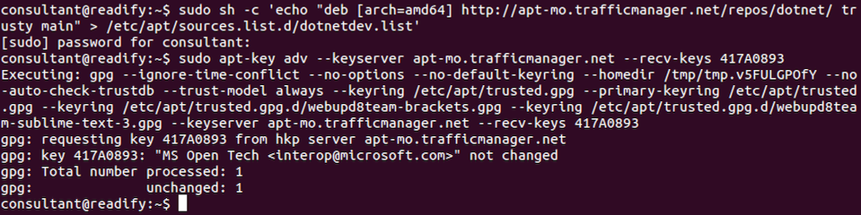
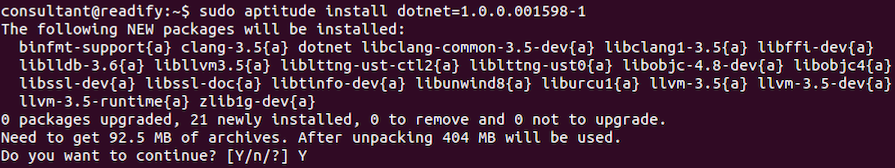
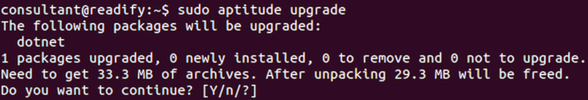
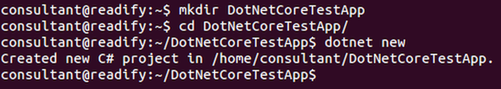
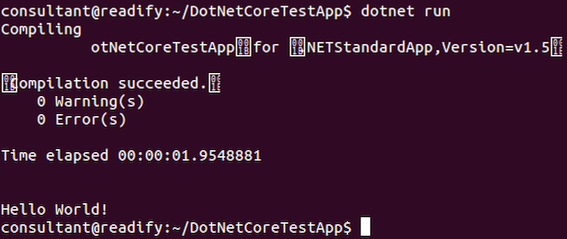

# Step 3 - .NET Core "Hello, world!"


## .NET Core on Ubuntu GNU/Linux 14.04.4 LTS

__Note:__ In order to avoid excessive rehashing of work that's currently in a state of flux I will be providing _fast_ instructions on how to install .NET Core on Ubuntu GNU/Linux 14.04.4 LTS.

For more information see [here](http://dotnet.github.io/getting-started/). The following is practically verbatim from that source.

#### Add the .Net Core APT feed (verbatim)

```
sudo sh -c 'echo "deb [arch=amd64] http://apt-mo.trafficmanager.net/repos/dotnet/ trusty main" > /etc/apt/sources.list.d/dotnetdev.list'
sudo apt-key adv --keyserver apt-mo.trafficmanager.net --recv-keys 417A0893
sudo aptitude update
```



#### Install .NET Core (verbatim)

```
sudo aptitude install dotnet=1.0.0.001598-1
```



#### Upgrade to latest (new step)

There's a newer version of .NET Core available so let's upgrade to that right away.

```
sudo aptitude update
sudo aptitude upgrade
```



#### .NET Core version (new step)

Let's check the version of `dotnet` that we've just upgraded to.

```
dotnet --version
```


Awesome! We now have version `1.0.0-beta-001673` of .NET Core.

#### Initialise some code (verbatim)

```
mkdir DotNetCoreTestApp
cd DotNetCoreTestApp
dotnet new
```



#### Run package restore (verbatim)

```
dotnet restore
```


#### Oh no! (new step)

So it turns out that `api.nuget.org` does not yet contain the .NET Core packages. You can find out more about this issue [here](https://github.com/dotnet/cli/issues/535). Let's try `dotnet restore` again, but this time we'll supply the package source as an extra parameter.

```
dotnet restore -s https://myget.org/f/dotnet-core
```


#### Run the app (verbatim)

```
dotnet run
```



## End of step 3

Excellent! You have said hello to the world of .NET Core :D

Have a quick break and then continue with [Step 4 - ASP.NET Core "Hello, world!"](Step4.md).
