# Step 4 - ASP.NET Core "Hello, world!"

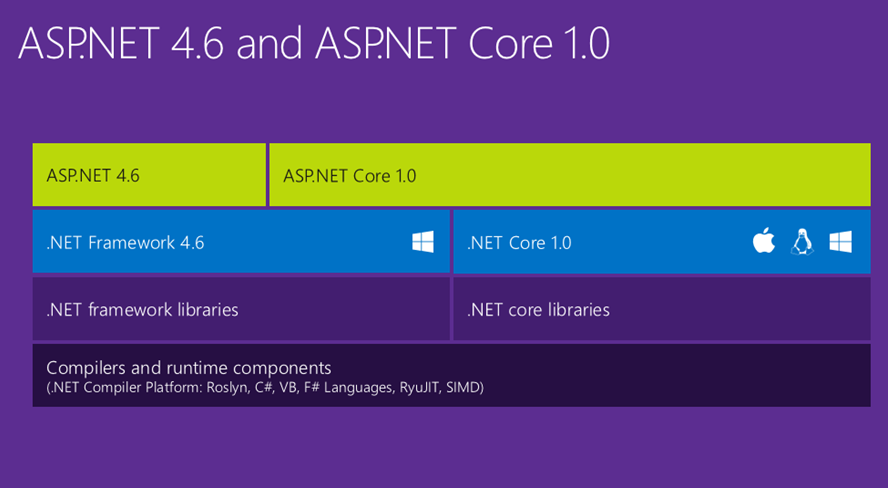

## ASP.NET Core on Ubuntu GNU/Linux 14.04.4 LTS

__Note:__ In order to avoid excessive rehashing of work that's currently in a state of flux I will be providing _fast_ instructions on how to install ASP.NET Core on Ubuntu GNU/Linux 14.04.4 LTS.

For more information see [here](https://docs.asp.net/en/latest/getting-started/installing-on-linux.html#installing-on-ubuntu-14-04). The following is practically verbatim from that source.

#### Install the .NET Version Manager (DNVM)

[DNVM](https://github.com/aspnet/dnvm) is used to install different versions of the .NET Execution Environment (DNX).

```
curl -sSL https://raw.githubusercontent.com/aspnet/Home/dev/dnvminstall.sh | \
DNX_BRANCH=dev sh && source ~/.dnx/dnvm/dnvm.sh
```


```
source ~/.dnx/dnvm/dnvm.sh
```

```
dnvm --version
```


#### Install the .NET Execution Environment (DNX)

[DNX](https://github.com/aspnet/dnx) contains the code required to bootstrap and run an application, including the compilation system, SDK tools, and the native CLR hosts.

The .NET Execution Environment (DNX) is used to build and run .NET projects.

```
sudo apt-get update
```

```
sudo apt-get install libunwind8 gettext libssl-dev libcurl4-openssl-dev zlib1g libicu-dev uuid-dev
```

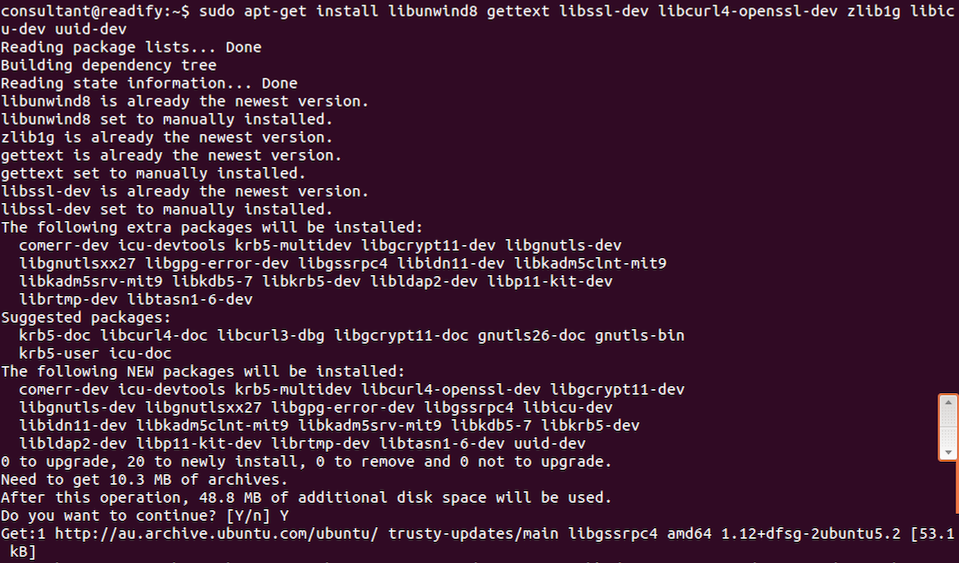

```
dnvm upgrade -r coreclr -alias coreclr-latest
```

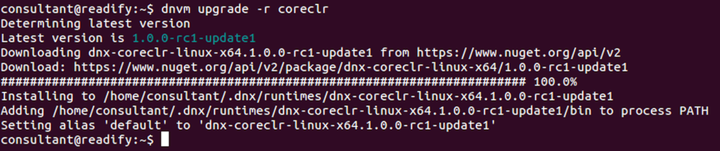

#### Install Mono

[Mono](http://www.mono-project.com/) is an open source implementation of Microsoft's .NET Framework based on the ECMA standards for C# and the Common Language Runtime.

```
sudo apt-get install mono-complete
```


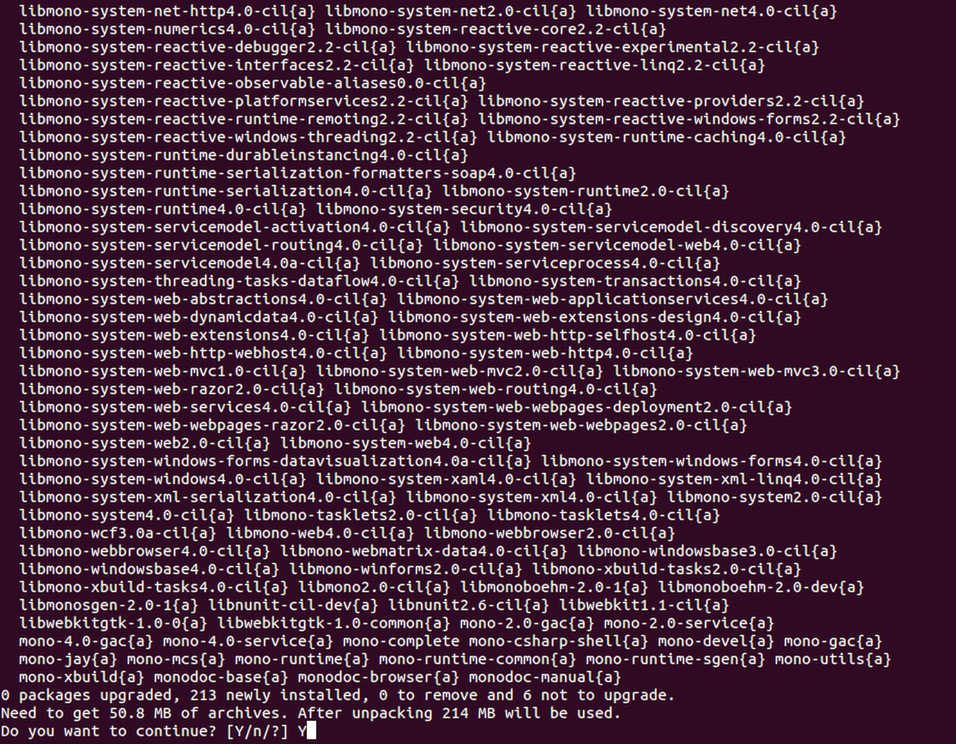


#### Upgrade to the latest Mono

As you can see above Ubuntu 14.04.4 LTS comes with version `3.2.8` of Mono. Let's upgrade to the latest version `4.2.2` directly from the The Mono Project.

```
sudo apt-key adv --keyserver hkp://keyserver.ubuntu.com:80 \
--recv-keys 3FA7E0328081BFF6A14DA29AA6A19B38D3D831EF
```

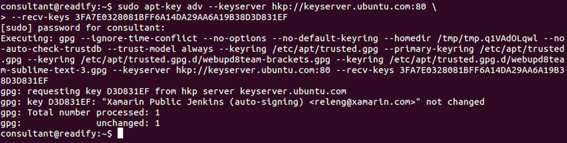

```
echo "deb http://download.mono-project.com/repo/debian wheezy main" | \
sudo tee /etc/apt/sources.list.d/mono-xamarin.list
```


```
sudo apt-get update
```

```
sudo apt-get upgrade
```


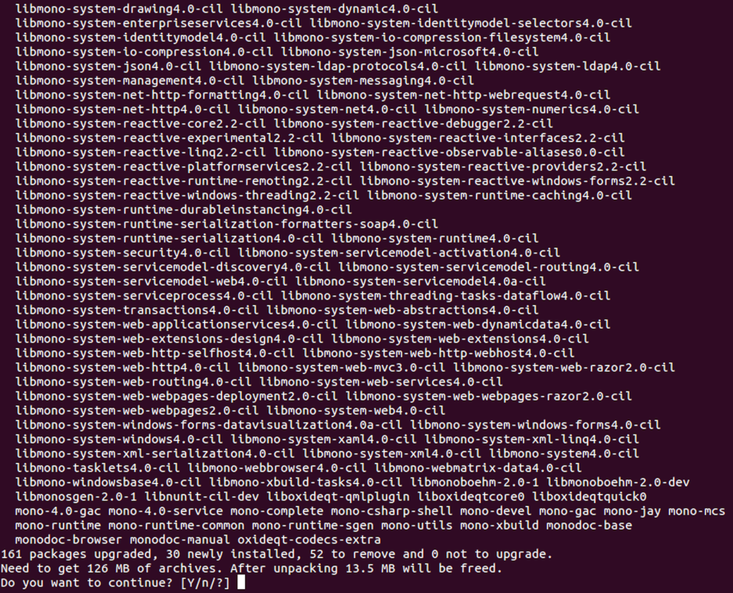


#### Upgrade to the latest DNX Mono

The following command will upgrade to the latest version of DNX which wraps Mono. After this you should have access to both the latest CoreCLR and Mono via DNX.

```
dnvm upgrade -r mono -alias mono-latest
```

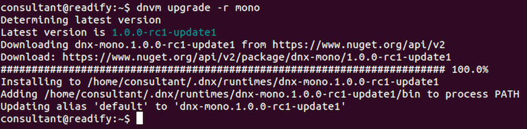

#### DNVM housekeeping

Awesome! We now have DNVM, DNX, CoreCLR and Mono installed and up to date.

Now let's take a look at a few DNVM housekeeping commands that will be used moving forward.

First let's make sure we know how to upgrade DNX itself.

```
dnvm update-self
```

```
dnvm
```


Excellent. We're up-to-date and we have access to the `dnvm` command.

Next let's see how we can list the DNX runtimes installed.

```
dnvm list
```

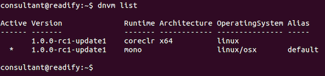

Great. We have access to the CoreCLR and Mono runtimes via DNX.

The small problem is we have our _default_ alias set to Mono. Let's update that.

```
dnvm alias default coreclr-latest
```

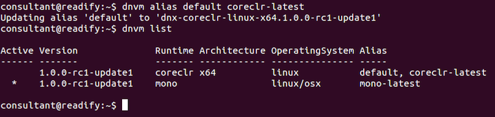

#### Build and install libuv

[Libuv](https://github.com/libuv/libuv) is a multi-platform support library with a focus on asynchronous I/O. It was primarily developed for use by [Node.js](https://nodejs.org), but we use it via [Kestrel](https://github.com/aspnet/KestrelHttpServer), a cross-platform HTTP server for hosting ASP.NET Core web applications.

```
sudo apt-get install make automake libtool curl
```

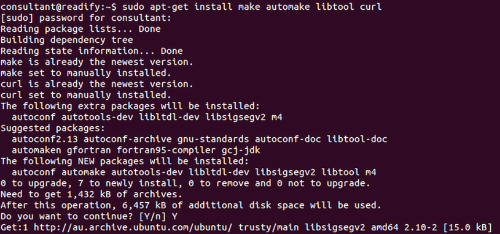

```
curl -sSL https://github.com/libuv/libuv/archive/v1.8.0.tar.gz | sudo tar zxfv - -C /usr/local/src
```


```
cd /usr/local/src/libuv-1.8.0
```

```
sudo sh autogen.sh
```


```
sudo ./configure
```

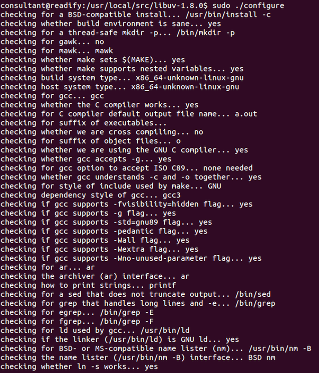

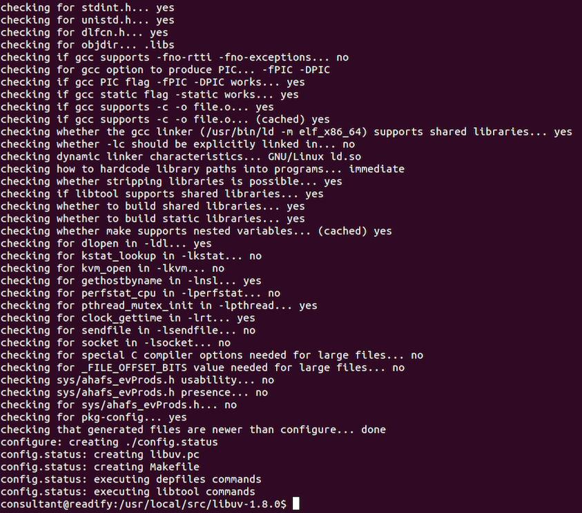

```
sudo make
```

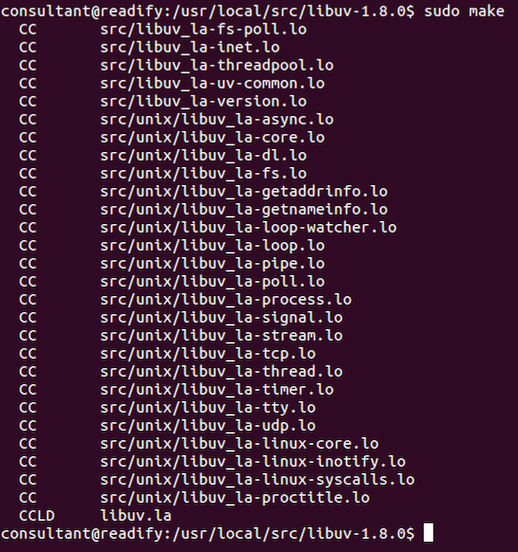

```
sudo make install
```

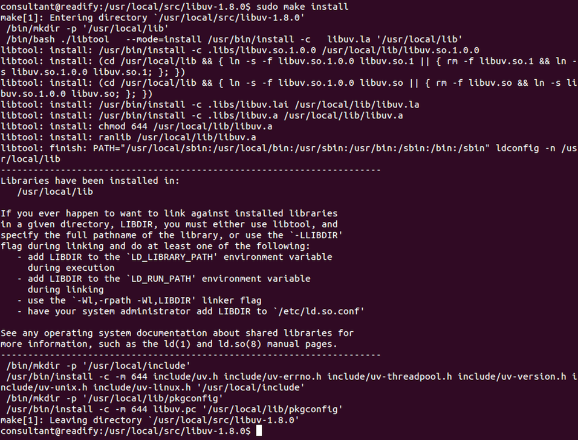

```
sudo rm -rf /usr/local/src/libuv-1.8.0 && cd ~/
```

```
sudo ldconfig
```

Great. We have `libuv` ready to go.

#### Install Node.js (via NVM)

We'll be using Node.js to scaffold our ASP.NET Core application via [Yeoman](http://yeoman.io/).

```
sudo apt-get install build-essential libssl-dev
```


```
curl -o- https://raw.githubusercontent.com/creationix/nvm/v0.31.0/install.sh | bash
```


__Note:__ Close and reopen your terminal to start using `NVM`.

OK let's take a look to see which versions of Node.js we have installed:

```
nvm list
```


Right you guessed it, we don't have _any_ version of Node.js installed.

So let's take a look at the versions of Node.js that are available to us:

```
nvm list-remote
```


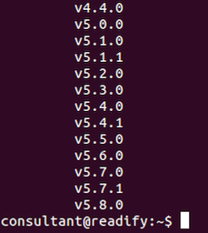

OK now we can install the latest LTS version of Node:

```
nvm install v4.4.0
```


Great. Let's confirm that Node and NPM are installed.

```
node -v && npm -v
```


Awesome! Oh wow! ... ;)

#### Install Yeoman

> Yeoman is the web's scaffolding tool for modern webapps.

```
npm install -g gulp grunt-cli bower yo
```

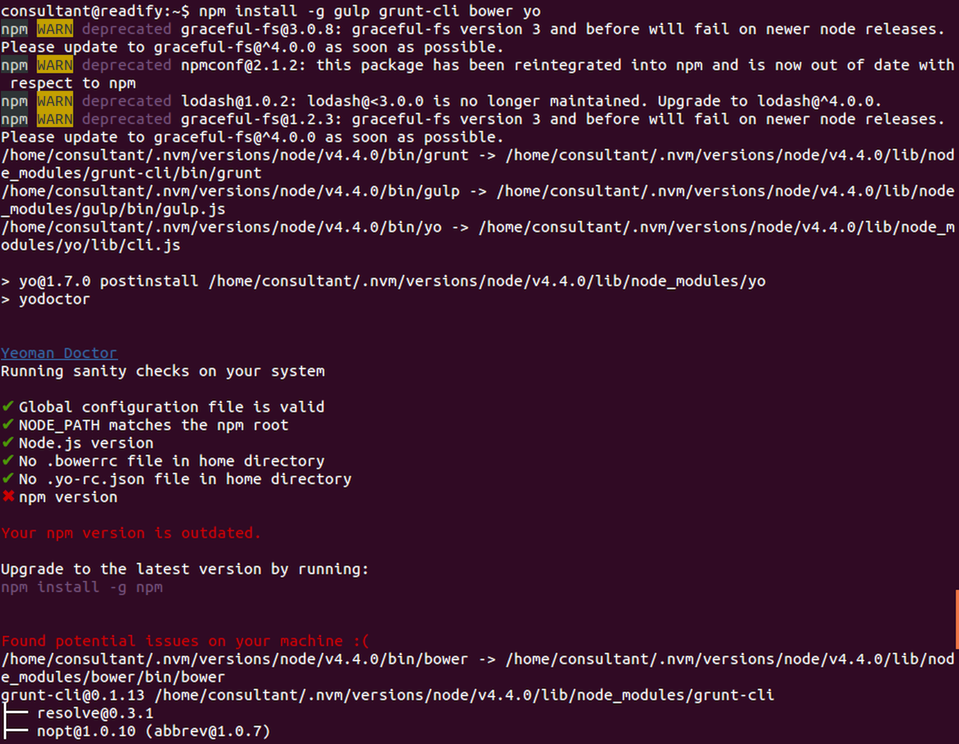


#### Upgrade NPM

You'll note in the screenshot above that Yeoman is recommending that we upgrade NPM so let's do that:

```
npm install -g npm
```


#### Install the Yeoman ASP.NET Core generators

Yeoman generators are just regular NPM packages.

```
npm install -g generator-aspnet
```

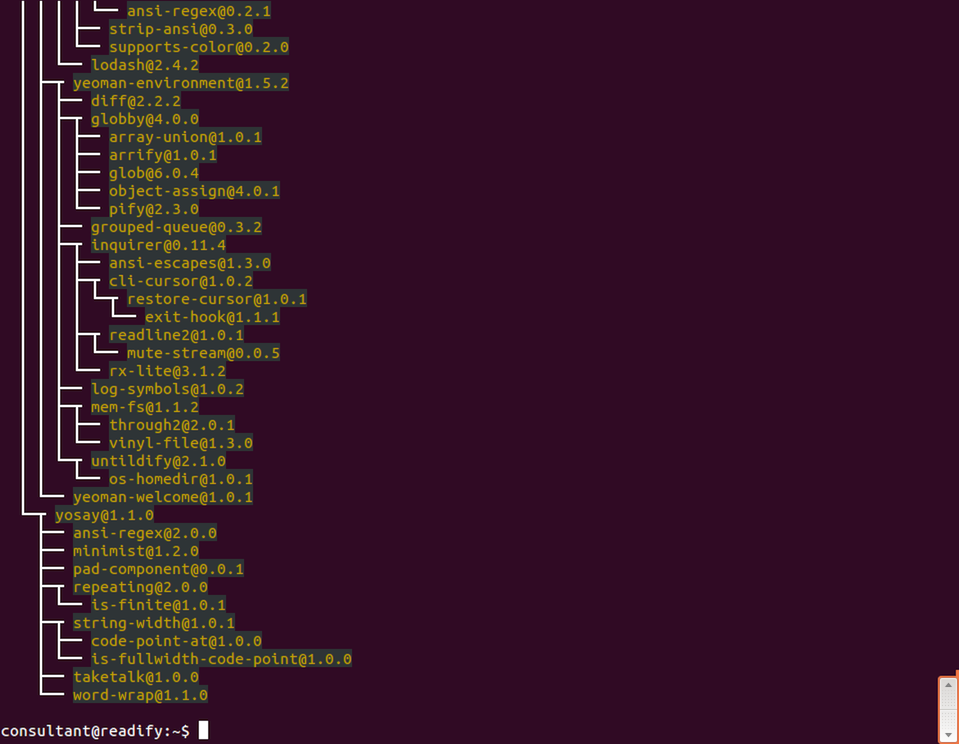


TODO: Continue from here => :|


#### Initialise some code

Now we have our ASP.NET Core toolchain up and running let's make some code.

TODO: Continue from here :)

## End of step 4

TODO: FIX THE BELOW!

Excellent! You have said `HELO` to the world of ASP.NET Core ;)

Have a quick break and then continue with [Step 5 - LXC/Docker](Step5.md).
