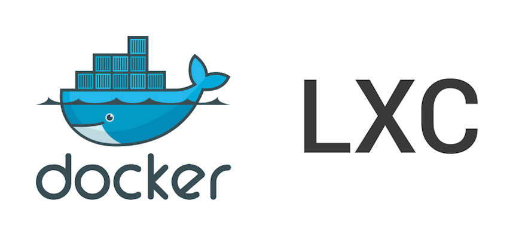

# Step 5 - LXC/Docker "Hello, world!"

## .NET Core on LXC/Docker on Ubuntu GNU/Linux 14.04.4 LTS

_What a mouthful..._

__TODO ? Continue on from here...__

## End of step 5

__Done!__ You know how to LXC/Docker "all the things".

The rest _as they say_ is history...
