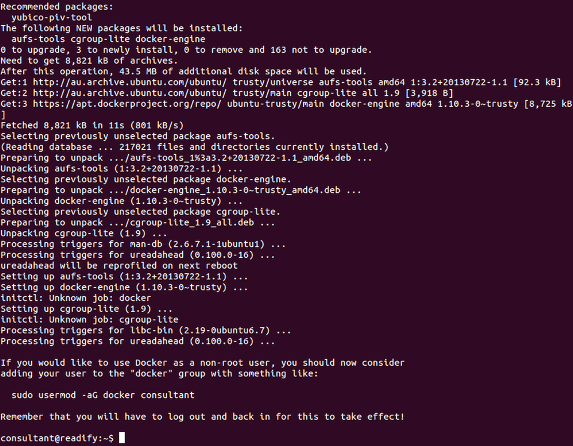
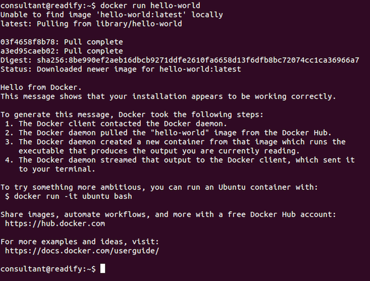
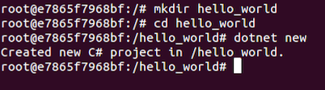
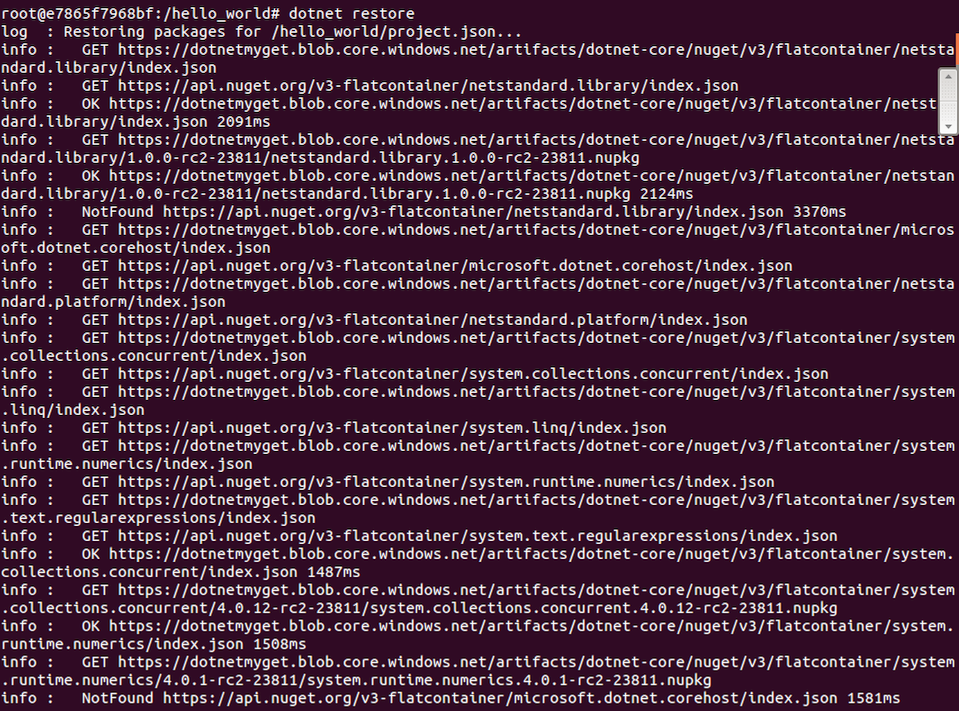
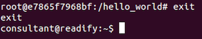

# Step 5 - LXC/Docker "Hello, world!"


## .NET Core on LXC/Docker on Ubuntu GNU/Linux 14.04.4 LTS

_What a mouthful..._

__Note:__ The following guide is really just a combo of [here](https://docs.docker.com/linux/) and [here](https://dotnet.github.io/getting-started/).

#### What is LXC (Linux Containers)?

> [LXC](https://en.wikipedia.org/wiki/LXC) ([Linux Containers](https://linuxcontainers.org/)) is an operating-system-level virtualization method for running multiple isolated Linux systems (containers) on a control host using a single Linux kernel.

#### What is Docker

> [Docker](https://en.wikipedia.org/wiki/Docker_(software)) is an open-source project that automates the deployment of applications inside software containers, by providing an additional layer of abstraction and automation of operating-system-level virtualization on Linux.

#### Installing Docker

Run the following to download and install the latest Docker package.

__Note:__ You may be prompted to supply your password for `sudo` this is ok.

```
curl -fsSL https://get.docker.com/ | sh
```




#### Allow Docker to run as your non-root user

We shouldn't need `root` to run Docker.

```
sudo usermod -aG docker consultant
```

> Remember that you will have to log out and back in for this to take effect!

Actually we'll need to reboot to make sure that `docker daemon` is running.

```
sudo reboot
```

#### Verify Docker is installed correctly

```
docker run hello-world
```



All is well.

#### Run the container using the dotnet base image

> The following command will get you a running container with the toolchain, straight off of [Microsoft's Docker Hub](https://hub.docker.com/r/microsoft/dotnet/).

> A [Docker Hub](https://www.docker.com/products/docker-hub) is a cloud hosted service from Docker that provides registry capabilities for public and private content.

```
docker run -it microsoft/dotnet:latest
```

__Note:__ This is a good time for a coffee break.


You may have noticed that you're no longer `consultant@readify` instead you are now `root@e7865f7968bf` (or something like that). This is because Docker has _sshed_ you into the running container. Yes it's that awesome and that fast.

#### Initialize some code

> Now that you are in a running container, let's initialize a sample Hello World application!

```
mkdir hello_world
```

```
cd hello_world
```

```
dotnet new
```



#### Run the application

> After the `dotnet new` command, the only thing we need is to restore the dependencies and run the application.

```
dotnet restore
```




```
dotnet run
```


#### Exiting your Docker container

```
exit
```



_Simples..._ ;)

## ASP.NET Core on LXC/Docker on Ubuntu GNU/Linux 14.04.4 LTS

There's a lot more to Docker than just running a Docker image then scaffolding and running an application.

__TODO ? Continue on from here...__

## End of step 5

__Done!__ You know how to LXC/Docker "all the things".

The rest _as they say_ is history...
